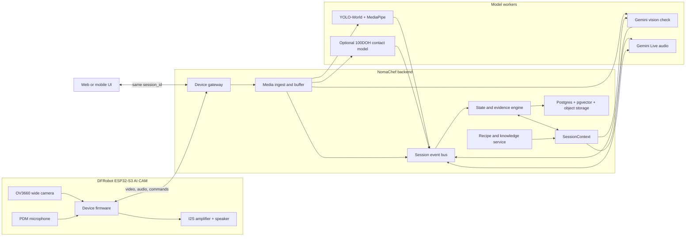

# NomaChef ESP32-first 技术规格

> 状态: Proposed baseline, 待 Claude Code cross-check
>
> 日期: 2026-07-23
>
> 产品名: NomaChef
>
> 仓库目录暂时仍为 `SousAI`

## 0. 结论和决策摘要

NomaChef 当前的硬件主线改为 **DFRobot ESP32-S3 AI CAM (DFR1154) + 云端/电脑端 AI**。Raspberry Pi 5 不再是基础方案，只保留为未来的本地算力备选，不进入当前采购和交付依赖。

核心分工如下:

- ESP32 负责相机、麦克风、扬声器、基础缓存、联网、心跳和媒体上传。
- 后端负责设备鉴权、媒体接入、会话状态、事件时序和模型调度。
- YOLO-World + MediaPipe 负责低延迟、连续的视觉弱证据。
- Gemini Flash 类 VLM 负责低频或事件触发的语义确认。
- Gemini Live 负责可打断的实时语音交互。
- RAG 只负责开餐前的菜谱检索和做菜中的受控知识查询，不进入逐帧检测循环。
- `SessionContext` 和后端状态机是唯一事实源。Gemini 对话历史不是系统状态数据库。

手物接触检测不是第一版 demo 的硬性前置条件，但对“拿起、倒入、移动、放下”这类动作很有价值。当前的 MediaPipe 几何启发式先用于打通数据闭环，100DOH 模型作为后续可替换的证据源。任何单个模型都不能独自决定步骤完成。

本文件从现在起是硬件和端到端架构的主规格，并取代以下旧假设:

- `CLAUDE.md` 中以 Raspberry Pi 5 为主设备的硬件描述
- `docs/hardware-bom.md` 的旧 Pi-first 采购方案
- `docs/PHASE1-GUIDELINE.md` 中关于 Pi 采集的未来规划

Phase 1 的本地感知代码和验收规则仍然有效。

## 1. 产品目标和当前边界

### 1.1 第一版要证明什么

1. 用户佩戴或固定 ESP32 摄像头后，后端能持续看到厨房工作区。
2. 系统能跟踪当前菜谱、当前步骤、关键物体和用户口头指令。
3. 用户可以自然打断、追问、重复指令或确认完成。
4. 系统用多种证据判断步骤是否可能完成，并在证据不足时询问用户。
5. 每次做菜都生成可回放、可分析的事件和媒体记录，为后续自有数据集积累样本。

### 1.2 第一版明确不做

- 不在 ESP32-S3 上运行 YOLO-World、MediaPipe 或大模型。
- 不要求逐帧 VLM，也不把完整视频持续发送给 VLM。
- 不承诺仅凭视觉自动判断所有烹饪步骤。
- 不使用未经验证的自动动作触发高风险建议。
- 不为了展示模型能力一次性下载全部公开厨房数据集。

## 2. 总体架构



设计原则:

- 设备端轻量化: ESP32 是采集和交互终端，不是 AI 推理主机。
- 快慢两层视觉: 快模型持续跑，VLM 低频确认。
- 事件驱动: 状态机消费带时间戳的证据，不直接消费模型自由文本。
- 可降级: VLM 或语音临时不可用时，视觉事件、按钮确认和固定 SOP 仍能工作。
- 可回放: 所有关键决策都能追溯到事件、帧、音频片段和模型调用。

## 3. 硬件基线

### 3.1 主板选择

当前基线是 [DFRobot ESP32-S3 AI CAM (DFR1154)](https://wiki.dfrobot.com/dfr1154/)。选择它的原因是尺寸小、相机视角广，而且主板已经集成了基本音频输入和扬声器功放。

官方关键规格:

- ESP32-S3, 双核 LX7, 最高 240 MHz
- 16 MB Flash, 8 MB PSRAM
- OV3660 3 MP 摄像头, 约 160° 视场角
- 可见光和 940 nm 红外能力
- 板载 PDM I2S 麦克风
- 板载 MAX98357 I2S 功放和扬声器接口
- microSD 卡槽
- USB-C 5 V 输入, VIN 标称 3.7-15 V
- 板体约 42 x 42 mm

它适合做摄像、录音、播放和联网，但算力和内存不足以替代后端运行当前的 YOLO-World、MediaPipe 和 Gemini 调用。

### 3.2 最小可运行硬件

| 部件 | 推荐 | 优先级 | 目的 |
|---|---|---:|---|
| 主板 | DFRobot DFR1154 | P0 | 相机、麦克风、功放、Wi-Fi 主控 |
| 扬声器 | 4 Ω 1.5 W 或 8 Ω 1 W, MX1.25-2P 接口 | P0 | AI 语音输出 |
| 存储 | 32-64 GB high endurance microSD | P0 | 断网缓存、诊断日志、短片段 |
| 开发电源 | 稳定 5 V / 2 A USB-C 电源 | P0 | 烧录和桌面测试 |
| 移动电源 | 5 V / 2 A 以上的小型 power bank | P0 | 第一版移动供电, 风险最低 |
| 固定结构 | 胸带或胸前夹具, 可调俯角 | P0 | 保证工作区稳定进入画面 |
| 短 USB-C 线 | 30-50 cm, 最好直角头 | P0 | 减少拉扯 |
| 保护外壳 | 通风、避油烟、可拆洗镜片窗口 | P1 | 提升可靠性和可展示性 |

### 3.3 电池方案

开发和首个 demo 优先使用成品 5 V power bank。它已经解决充电、保护和稳压，故障面最小。

需要更小体积时，可以使用 [DFRobot DFR1026 1S Li battery charge/discharge module](https://www.dfrobot.com/product-2632.html) 加受保护的 1S LiPo 3000-5000 mAh。该模块可提供 5 V / 2 A 输出并支持边充边放。

接线原则:

```text
protected 1S LiPo
  -> DFR1026 battery input
  -> regulated 5 V output
  -> DFR1154 USB-C or confirmed 5 V input path
```

安全约束:

- DFR1154 本身不是裸锂电池充电器。
- 不把裸电芯直接接到 5 V 引脚。
- 线材、开关和连接器必须按 2 A 以上留余量。
- 电池远离炉面、蒸汽和油锅，建议放在腰侧而不是胸前相机外壳内。
- 最终接线前必须按实际板卡版本核对 DFR1154 和 DFR1026 的丝印、极性和原理图。

### 3.4 麦克风和扬声器

第一版使用板载 PDM 麦克风和板载 MAX98357 功放。先把回声消除、噪声抑制、VAD 和安装位置调好，再决定是否增加麦克风硬件。

固件可评估 Espressif [ESP-SR AEC](https://docs.espressif.com/projects/esp-sr/en/latest/esp32s3/acoustic_echo_cancellation/README.html)。AEC 必须同时获得麦克风输入和扬声器播放参考信号，单纯换更贵的麦克风不会自动解决回声。

外接麦克风的现实限制:

- DFR1154 易用的外露 GPIO 很少，外接 PDM/I2S 麦克风不是即插即用。
- GPIO43/44 是否可用、是否与板上外设冲突，必须按当前硬件版本和原理图验证。
- 不建议在 DFR1154 基线中直接接 ReSpeaker USB 或复杂麦克风阵列，它会引入 USB host、I2S 引脚和供电问题。
- 如果实测证明单麦克风在油烟机、煎炒声和扬声器回放环境下无法达到要求，优先换用集成多麦克风和更强媒体能力的板卡，而不是继续堆转接线。

### 3.5 安装位置和画面

DFR1154 的约 160° 视场角很广，能看到更多场景，但目标在画面中的像素会变小。建议初始安装参数:

- 相机在胸前或肩下，向下 35-50°。
- 相机到主要操作面的距离约 50-70 cm。
- 构图优先覆盖锅、案板和双手，不要求看到整个厨房。
- 服务端可裁掉画面两侧无用区域，提高有效目标像素。
- 正常做菜时关闭红外补光，避免影响颜色和熟度判断。
- 镜头窗口要可擦拭，并避免正对蒸汽。

### 3.6 什么时候考虑 ESP32-P4

DFR1154 先完成 MVP。如果出现以下任一硬阻塞，再评估 ESP32-P4 类板卡:

- S3 无法同时稳定推送所需视频和实时音频。
- 必须使用硬件 H.264 来降低带宽。
- 必须接多麦克风、显示屏或更多传感器。
- 需要更强的端侧预处理或轻量神经网络。

[ESP32-P4](https://www.espressif.com/en/products/socs/esp32-p4) 支持硬件 H.264，最高可到 1080p30。集成度更高的 [ESP32-P4X-EYE](https://docs.espressif.com/projects/esp-dev-kits/en/latest/esp32p4/esp32-p4x-eye/user_guide.html) 可作为第二代硬件参考，但它不是当前交付依赖。

## 4. 设备固件职责和媒体协议

### 4.1 ESP32 应做的事情

- 首次配网和设备注册
- TLS 连接、设备身份、心跳和重连
- 摄像头采集、分辨率切换和 JPEG 压缩
- 麦克风采集、基础 VAD/AEC/NS
- 扬声器流式播放和音量控制
- microSD 环形缓存
- 断网后保留关键片段，恢复后补传
- 接收 `start_session`、`stop_session`、`set_capture_profile`、`play_audio` 等命令
- 上报固件版本、供电状态、温度、信号质量和丢帧统计

### 4.2 ESP32 不应做的事情

- 保存 Gemini、Supabase 或其他云服务的长期 API key
- 自己决定菜谱步骤完成
- 运行未经验证的高风险安全规则
- 将整段原始音视频无边界保存或上传

### 4.3 第一版传输策略

推荐把视频和音频分开传输，后端用同一个 `session_id` 和时间戳重新对齐。

| 通道 | MVP 方案 | 初始目标 | 说明 |
|---|---|---:|---|
| 连续视频 | MJPEG over HTTP 或 WebSocket JPEG frames | 640x480, 5-10 FPS | 实际帧率以 DFR1154 烧机结果为准 |
| 关键帧 | HTTPS JPEG upload | 720p 或更高 | 每 10-15 秒、步骤事件或语音请求触发 |
| 上行音频 | WebSocket PCM | mono 16 kHz, 20-100 ms chunk | 适配实时语音流 |
| 下行音频 | WebSocket PCM | 与固件播放链路匹配 | 必须给 AEC 播放参考 |
| 控制事件 | WebSocket JSON | 低延迟 | 心跳、命令、确认、状态 |

仓库现有 `harness/live_perception.py --source` 通过 OpenCV `VideoCapture` 读取来源。DFRobot CameraWebServer 的 MJPEG URL 可以作为最短集成路径，但必须先验证该 URL 在长时间运行时的重连和资源释放。

生产化后再决定是否切换 WebRTC、H.264 或自定义二进制协议。MVP 不要同时发多个不同清晰度的连续视频流。

## 5. 当前软件栈和目标软件栈

### 5.1 当前仓库已经实现

| 模块 | 当前实现 | 运行位置 | 状态 |
|---|---|---|---|
| 开放词汇物体检测 | Ultralytics YOLO-World `yolov8s-worldv2.pt` | Mac, PyTorch MPS | 已实现 |
| 手部关键点 | MediaPipe Hand Landmarker, 21 点 | Mac CPU | 已实现 |
| 手物关系融合 | 框距离、重叠、`grip_closure` | Mac | 已实现, 仅启发式 |
| 事件去抖 | `InteractionTracker(k_frames=3)` | Mac | 已实现 |
| 会话日志 | 每次 session 一份 JSONL | Mac 本地 | 已实现 |
| 实时可视化 | 绿色物体框、橙色手骨架、FPS | Mac | 已实现, live 验收未完成 |
| ESP32 视频接入 | 无 | 无 | 待实现 |
| Gemini VLM | 无 | 无 | 待实现 |
| Gemini Live | 无 | 无 | 待实现 |
| 状态机、RAG、Supabase | 无 | 无 | 待实现 |

当前本地摄像头调试结论:

- macOS `source 0` 曾连接到 iPhone Continuity Camera，画面呈粉红/暗色，不适合作为测试源。
- `source 1` 是正常的 Mac 摄像头画面。
- YOLO 日志曾在 `source 1` 检出 `cup`，但绿色框和完整 holding start/end 仍需按 `docs/HANDOFF-live-test.md` 完成正式验收。
- 在 live 验收通过前，不做仓库首次 commit。

### 5.2 目标后端组件

| 组件 | 建议技术 | 职责 |
|---|---|---|
| Device Gateway | Python FastAPI 或 TypeScript 服务, WebSocket + HTTPS | 鉴权、心跳、命令、重连 |
| Media Ingest | 独立异步 worker + 短时内存缓冲 | 接收帧和音频, 生成统一引用 |
| Fast Perception | Python, PyTorch, Ultralytics, MediaPipe | 连续检测和手物弱证据 |
| VLM Orchestrator | Gemini API 客户端 | 关键帧结构化验证 |
| Voice Orchestrator | Gemini Live API 客户端 | 实时语音、打断和工具调用 |
| State Engine | 纯业务代码, 可确定性回放 | 步骤、证据、超时和安全规则 |
| Recipe/RAG | Postgres + pgvector | 菜谱检索、版本化 SOP、受控问答 |
| Persistence | Supabase Postgres + Storage | 会话、事件、媒体和用户数据 |
| UI | Next.js 或现有 Web 技术 | 当前步骤、设备状态、调试画面 |

后端可以先在 Mac 上运行，设备接入稳定后再部署云端。代码结构要让模型 worker 可单独扩容，不能把每帧推理塞进 WebSocket 请求线程。

## 6. 快慢两层视觉

### 6.1 Layer 1: 连续快速感知

YOLO-World 按当前 SOP 步骤动态设置英文词表。MediaPipe 每帧找手部关键点，融合层生成如下弱证据:

- 目标物体出现或消失
- 手靠近物体
- 手可能握住物体
- 物体进入锅或案板 ROI
- 关系开始、持续和结束

建议初始核心类别保持在 15-20 个，不要无限扩词表:

```text
hand, wok, frying_pan, spatula, cutting_board, kitchen_knife,
bowl, plate, cup, bottle, soy_sauce_bottle, vinegar_bottle,
cooking_oil_bottle, egg, scallion, garlic
```

YOLO-World 的 CLIP 文本编码器以英文类别更稳。中文名称、别名和品牌名由后端映射到稳定的英文 `class_id`。

### 6.2 Layer 2: 低频语义确认

VLM 只在以下情况调用:

- 每 10-15 秒的低频巡检
- 状态机接近步骤阈值，但仍缺关键证据
- 用户说“我做好了吗”“看一下锅里”
- 关键物体进入指定 ROI
- 异常、安全或长时间无进展

VLM 必须返回结构化 JSON，并由后端做枚举、范围和业务逻辑校验。结构化输出只能保证 JSON 形状，不能保证语义正确。

示例输出:

```json
{
  "frame_id": "frm_01842",
  "step_id": "step_03",
  "observations": [
    {
      "predicate": "soy_sauce_over_wok",
      "value": true,
      "confidence": 0.78
    }
  ],
  "safety_flags": [],
  "uncertain": false
}
```

## 7. 手物接触是否必要

### 7.1 决策

**不是第一版 demo 的硬性前置条件，但应该保留为高价值证据。**

对于“食材是否在锅里”“锅内颜色是否变化”“计时是否结束”，手接触不是必要信号。对于“拿起酱油”“移动刀具”“倒入调料”“放下碗”，接触关系可以明显减少仅靠物体位置造成的误判。

第一版不应让 `hand_holding_object` 单独推进步骤。例子:“加入酱油”可以组合以下证据:

| 证据 | 示例权重 | 说明 |
|---|---:|---|
| 酱油瓶被手持并移动到锅上方 | 0.35 | 快模型或 100DOH |
| 瓶体姿态或位置变化符合倾倒 | 0.15 | 几何或短时轨迹 |
| 锅内视觉发生合理变化 | 0.20 | VLM 或 ROI 变化 |
| VLM 判断“疑似已加入” | 0.20 | 低频确认 |
| 用户口头确认 | 0.30 | 高价值但仍保留审计 |

权重只是初始设计，必须用自有录像回放校准。状态机要允许“证据不足，询问用户”，不要强行猜测。

### 7.2 当前 MediaPipe 启发式

当前代码使用手部 `grip_closure` 加物体框距离/重叠判断 near 或 holding。它适合快速打通事件结构，但存在明显限制:

- 2D 关键点无法确认真实接触。
- 手可能遮住物体框。
- 宽角畸变和小目标会放大误差。
- 对瓶子、刀柄、碗边等不同握法缺乏统一阈值。

因此事件协议应使用通用字段 `hand_object_relation`，并带 `source` 和 `confidence`。未来可把启发式换成 100DOH 模型，而不改状态机接口。

## 8. 100DOH 是什么

[100 Days of Hands (100DOH)](https://fouheylab.eecs.umich.edu/~dandans/projects/100DOH/download.html) 是一个面向日常视频的手-物交互数据集和预训练检测方案。它关注的重点不是菜品分类，而是:

- 手的位置
- 与手交互的物体位置
- 手的接触状态
- 手和物体之间的关联

它不是厨房专用数据集，所以不能直接解决“这是酱油还是醋”“这道菜是什么”这些问题。它适合增强 `hand_object_relation`，尤其是当前 MediaPipe 几何启发式不稳时。

推荐使用方式:

1. 不把 100DOH 全量数据加入当前环境。
2. 在独立 Python 环境中先运行官方预训练模型。
3. 用 50-100 张 NomaChef 第一人称厨房帧评估接触状态和关联质量。
4. 如果明显优于当前启发式，再封装为可选 worker。
5. 商用前单独核对数据和模型的许可、再分发与训练限制。

官方实现依赖较旧的检测栈时，不要为了兼容它破坏当前 YOLO-World/MediaPipe 的 `.venv`。

## 9. 数据集策略

### 9.1 数据集各自解决什么问题

| 数据源 | 适合任务 | 不适合任务 | 当前优先级 |
|---|---|---|---:|
| NomaChef 自采第一人称视频 | 真实机位、调料瓶、手物关系、状态机评估 | 初期规模小 | P0 |
| [VISOR](https://epic-kitchens.github.io/VISOR/site) | 厨房第一人称分割、手物关系、常见工具 | 中国调料品牌和具体菜品覆盖有限 | P1, 只取子集 |
| [100DOH](https://fouheylab.eecs.umich.edu/~dandans/projects/100DOH/download.html) | 手接触状态、交互物体关联 | 非厨房专属, 不识别菜品 | P1, 先测预训练模型 |
| [Open Food Facts](https://openfoodfacts.github.io/openfoodfacts-server/api/) | 包装商品、品牌、条码、成分 | 没有厨房场景框和手物动作 | P1, 做商品知识和图片补充 |
| [ChineseFoodNet](https://sites.google.com/view/chinesefoodnet/) | 约 208 类中国成品菜分类 | 不是过程检测, 不是调料瓶检测 | P2 |
| [FoodSeg103](https://arxiv.org/abs/2105.05409) | 食材级语义分割 | 规模和场景不等于穿戴式做菜视频 | P2 |
| EPIC-KITCHENS 系列 | 第一人称动作和厨房研究 | 数据量大, 集成成本高 | P2 |

VISOR 官方页面给出的规模约为 272K 手工 mask、257 个物体类别和 67K 手物关系。其许可为 CC BY-NC 4.0，商业产品训练前必须单独处理许可问题。

ChineseFoodNet 主要是约 185K 图片、208 个中国成品菜类别的分类数据。它可以用于“最后成品更像哪道菜”的研究，不适合解决“手是否拿着酱油瓶”。

### 9.2 现在应该采什么

先采自有数据，不下载全量大型数据集:

1. 录 10 段每段 2-3 分钟的第一人称备菜或做菜视频，总计 20-30 分钟。
2. 覆盖正常光、背光、蒸汽、油烟、遮挡、空手、戴手套和不同瓶型。
3. 每段保留原视频、设备参数、SOP 版本和事件 JSONL。
4. 从中抽 500-2000 帧，优先标注核心物体框、手框、接触关系和关键 ROI。
5. 建立固定 train/validation/test 切分，测试菜谱和厨房不能全部与训练集重合。

推荐标注结构:

```json
{
  "frame_id": "frm_01842",
  "objects": [
    {"id": "obj_7", "class_id": "soy_sauce_bottle", "bbox": [0.42, 0.25, 0.61, 0.78]}
  ],
  "hands": [
    {"id": "hand_r", "side": "right", "bbox": [0.31, 0.33, 0.56, 0.82]}
  ],
  "relations": [
    {"subject": "hand_r", "predicate": "holding", "object": "obj_7"}
  ],
  "step_id": "step_03"
}
```

### 9.3 酱油这类物品怎么识别

不要只依赖一个全球数据集。建议组合三层:

1. 通用外形: YOLO-World 检测 bottle、jar、packet。
2. 自有类别: 用本地厨房和目标品牌图片补充 `soy_sauce_bottle`、`vinegar_bottle`、`cooking_oil_bottle`。
3. 语义确认: 条码、OCR、Open Food Facts 或关键帧 VLM 识别品牌和成分。

对于倒进碗里的无包装酱油，仅凭单张 RGB 图片很难与醋、老抽或其他深色液体稳定区分。系统应更多利用“刚才拿的瓶子、倾倒轨迹、SOP 当前材料和用户确认”这组上下文。

## 10. 统一事件和时序

### 10.1 一个 session, 一条时间轴

视觉、语音、按钮和模型输出都必须带同一个 `session_id`。建议事件信封:

```json
{
  "event_id": "evt_01J...",
  "session_id": "ses_01J...",
  "seq": 1842,
  "type": "perception.hand_object_relation",
  "t_device_ms": 391884,
  "received_at": "2026-07-23T08:22:04.381Z",
  "frame_id": "frm_01842",
  "audio_range": null,
  "source": "mediapipe_geometry_v1",
  "confidence": 0.72,
  "payload": {
    "hand": "right",
    "relation": "holding",
    "object_class": "soy_sauce_bottle"
  }
}
```

字段规则:

- `t_device_ms` 是设备启动后的单调时钟，防止设备墙上时钟漂移。
- `received_at` 由后端写入。
- `seq` 由会话服务统一分配，作为最终排序依据。
- 每帧有 `frame_id`，每段音频有采样区间或 `audio_range`。
- 原始模型结果不可直接覆盖业务状态，只能新增 evidence event。
- 重连和补传必须幂等，使用稳定的 `event_id` 去重。

### 10.2 SessionContext 是事实源

后端维护一个紧凑、版本化的 `SessionContext`:

```json
{
  "session_id": "ses_01J...",
  "recipe_version_id": "rv_mapotofu_7",
  "current_step_id": "step_03",
  "step_status": "in_progress",
  "started_at": "2026-07-23T08:18:00Z",
  "recent_evidence": [],
  "pending_question": null,
  "active_objects": ["wok", "soy_sauce_bottle"],
  "user_preferences": {"language": "zh-CN", "verbosity": "short"},
  "safety_constraints": ["allergy_peanut"],
  "context_version": 43
}
```

所有模型调用都从这个对象生成 prompt/context snapshot。模型输出经过验证后产生新事件，再由状态机更新 `SessionContext`。这样语音和视觉不会各自维护一套互相冲突的“当前步骤”。

## 11. 语音、视觉和状态机如何同步

### 11.1 推荐链路

1. 设备持续上传音频和低帧率画面。
2. 快视觉 worker 把检测结果写成带 `frame_id` 的事件。
3. Gemini Live 产生 transcript、用户意图和工具调用事件。
4. 会话总线按 `session_id` 和时间窗把语音、视觉、按钮事件送入状态机。
5. 状态机更新证据分数和当前步骤。
6. 语音回复前，从最新版 `SessionContext` 生成短上下文。
7. 用户询问视觉问题时，后端选取请求时间附近的最新清晰帧调用 VLM。

例子:

```text
t=12.20s  vision: right hand holding soy_sauce_bottle
t=12.55s  vision: bottle over wok
t=12.90s  voice:  "酱油我放了"
t=13.10s  state:  evidence threshold reached, request one VLM check
t=13.80s  VLM:    likely added, confidence 0.81
t=13.82s  state:  step_03 -> completed
t=13.90s  voice:  "好，下一步把火调小。"
```

### 11.2 Gemini Live 和视觉调用分开

推荐保持:

- 一个 audio-only Gemini Live session 负责实时对话。
- 独立的 Gemini VLM 请求负责选定关键帧。
- 两者共享后端 `SessionContext`，但不共享模型内部不可控的长对话状态。

这样可以降低带宽和成本，也避开 Live 音视频 session 在无压缩时上下文很快耗尽的问题。按当前官方文档，无上下文压缩时 audio-only 大约可支持 15 分钟，audio-video 大约 2 分钟；单连接也可能在约 10 分钟附近结束。因此实现必须使用 [context compression 和 session resumption](https://ai.google.dev/gemini-api/docs/live-api/session-management)，并在重连时重新注入紧凑 context snapshot。

Live 音频按官方建议使用 16 kHz 单声道输入和 20-100 ms chunk。直接从设备连接 Live API 只能在后续使用短期 [ephemeral token](https://ai.google.dev/gemini-api/docs/live-api/ephemeral-tokens)，长期 API key 不能放进固件。MVP 统一经过 NomaChef 后端更容易做审计、重试和上下文同步。

### 11.3 工具调用边界

Gemini 可以请求调用工具，但后端决定是否执行。建议首批工具:

- `get_current_step()`
- `repeat_instruction()`
- `request_visual_check(question)`
- `user_confirm_step(step_id)`
- `set_timer(duration_s, label)`
- `report_problem(category)`

`advance_step()` 不直接暴露给模型，或者只允许模型提出候选。真正推进必须经过状态机校验。Gemini [function calling](https://ai.google.dev/gemini-api/docs/function-calling) 的职责是表达调用意图，业务服务负责执行和回传结果。

## 12. RAG 如何管控

### 12.1 RAG 不进入逐帧主循环

做菜过程中的当前 SOP 通常只有几 KB，应在 session 开始时完整冻结到 `sop_snapshot`。逐帧检索向量库会增加延迟、费用和不一致，不会让检测更准确。

推荐边界:

| 场景 | 是否用 RAG | 数据来源 |
|---|---|---|
| 用户选菜 | 是 | 菜谱名、食材、口味、时间向量检索 |
| 生成或导入 SOP | 是, 但需审核 | 版本化菜谱库和可信来源 |
| 当前步骤播报 | 否 | 冻结的 `sop_snapshot` |
| 每帧检测 | 否 | 当前步骤的目标物体和规则 |
| 用户问“可以用什么替代” | 可以 | 受控食材替换知识库 |
| 过敏和食品安全 | 谨慎 | 确定性规则优先, 只查可信来源 |
| 步骤推进 | 否 | 状态机和 evidence events |

### 12.2 菜谱版本冻结

Session 创建时固定:

- `recipe_version_id`
- `sop_snapshot`
- 单位和份量
- 用户替换项
- 过敏和饮食限制
- 模型和 prompt 版本

做菜过程中外部菜谱更新不能改变当前 session。确需修改时，必须产生显式 `recipe_patch` 事件和新的 `context_version`。

### 12.3 检索结果防护

- 只允许白名单语料进入生产索引。
- 每个 chunk 保存来源、版本、语言和审核状态。
- 过滤网页中的指令性文本，避免 prompt injection。
- 检索答案必须带内部 source id，便于审计。
- 过敏、温度、食物保存等高风险问题使用确定性规则和人工审核内容。
- 模型回答不能写回菜谱主数据，除非经过独立审批流程。

## 13. 数据存储建议

建议 Supabase 提供 Postgres、pgvector、对象存储和认证。最小表结构:

| 表 | 关键字段 | 用途 |
|---|---|---|
| `users` | id, preferences, safety_profile | 用户偏好和安全信息 |
| `devices` | id, owner_id, firmware, last_seen | 设备注册和健康状态 |
| `recipes` | id, title, tags | 菜谱逻辑实体 |
| `recipe_versions` | id, recipe_id, sop_json, embedding | 可冻结的 SOP 版本 |
| `sessions` | id, user_id, device_id, recipe_version_id, status | 一次做菜会话 |
| `step_events` | event_id, session_id, seq, type, payload | 统一事件流 |
| `media_artifacts` | id, session_id, type, uri, retention | 帧、音频和片段 |
| `model_calls` | model, prompt_version, input_refs, output, latency, cost | 模型审计 |
| `user_preferences` | user_id, key, value | 可独立演进的偏好 |

存储策略:

- 事件长期保存，原始连续媒体短期保存。
- 默认只保留关键帧和用户授权的训练片段。
- 对象存储使用 signed URL 和 RLS。
- API key 只存在服务端 secret manager。
- 训练授权与产品运行授权分开记录。

## 14. 可观测性和成本控制

每次模型调用至少记录:

- `session_id`, `step_id`, `context_version`
- provider、model、API version
- prompt/schema version
- 输入帧或音频引用
- 输出、校验结果和被拒原因
- 首 token 延迟、总延迟、token/音频用量和估算成本

需要监控的产品指标:

- 设备在线率和重连次数
- 视频有效 FPS、帧新鲜度和丢帧率
- 语音首响应延迟和打断成功率
- VLM 调用次数和单 session 成本
- 步骤自动确认率、用户纠正率和误推进率
- `unknown` 或证据不足占比
- AEC 回声残留和 VAD 误触发率

成本控制顺序:

1. 先减少 VLM 调用频率。
2. 再减少关键帧分辨率和无效媒体保存。
3. 缓存静态 SOP 和检索结果。
4. 快模型独立扩容，不让音频 session 阻塞视觉 worker。

## 15. 测试和验收矩阵

### 15.1 当前 Phase 1

- [x] 单元测试 10/10 通过
- [x] YOLO-World 可在 Mac MPS 上运行
- [x] MediaPipe Hands 和事件 JSONL 已实现
- [x] `source 1` 能显示正常 Mac 摄像头画面
- [ ] 绿色目标框在 live 窗口中稳定可见
- [ ] 橙色手骨架稳定可见
- [ ] holding start 和 holding end 都触发
- [ ] JSONL 可逐行解析并包含完整事件闭环
- [ ] 实测结果填回 `docs/HANDOFF-live-test.md`
- [ ] 完成首次 git commit

### 15.2 ESP32 到货后的硬件验收

- [ ] 通过 USB-C 稳定启动、烧录和恢复
- [ ] 连续视频 30-60 分钟无内存泄漏或不可恢复卡死
- [ ] 目标清晰度下达到约定有效 FPS, 实际数值记录在测试报告
- [ ] 音频上行和扬声器下行可同时工作
- [ ] AEC 在扬声器播报时仍能识别用户打断
- [ ] Wi-Fi 断开后自动重连并补传关键事件
- [ ] microSD 环形缓存不会写满锁死
- [ ] power bank 和电池模块分别完成运行时长、温升和低电压测试
- [ ] 蒸汽、油烟和逆光场景下仍能得到可用关键帧

### 15.3 模型和状态机验收

- [ ] 固定 20-30 张关键帧 fixture, VLM 严格返回 schema
- [ ] 相同输入多次调用的关键字段稳定性可接受
- [ ] 100DOH 预训练模型在自有 50-100 帧上优于或补充当前启发式
- [ ] 所有步骤状态可通过事件 JSONL 确定性回放
- [ ] 单一低置信度模型事件不能推进关键步骤
- [ ] 语音误听、视觉误检和乱序事件都有测试
- [ ] audio-only Live 连续运行超过 10 分钟并能恢复 session
- [ ] 用户打断、重复、确认和断网重连均有端到端测试

## 16. 分阶段实施路径

### Phase A: 完成现有本地视觉基线

1. 用 Mac `source 1` 完成 live 验收。
2. 录 2-3 分钟固定测试视频。
3. 调好 `grip_closure`、置信度和去抖参数。
4. 填写 handoff 实测记录。
5. 首次 commit。

### Phase B: ESP32 媒体终端

1. 跑通 DFR1154 CameraWebServer 和本地 MJPEG 接入。
2. 固化设备 ID、心跳、重连和 capture profile。
3. 加入 16 kHz 音频上行和扬声器下行。
4. 实测 AEC、VAD、热量、供电和 Wi-Fi。
5. 用现有 harness 读取 ESP32 URL，不先改感知算法。

### Phase C: 统一事件和状态机

1. 定义 event envelope 和 `SessionContext` schema。
2. 把本地 JSONL 事件迁移为可回放的服务端事件流。
3. 实现 recipe version、step evidence 和 deterministic transitions。
4. 接入 Supabase 表、对象存储和 RLS。

### Phase D: Gemini

1. 先做 20-30 张固定图的 VLM structured output 测试。
2. 再做 audio-only Gemini Live hello world。
3. 接入工具调用，但不允许模型直接推进步骤。
4. 加 session resumption、context compression 和调用审计。
5. 最后把视觉事件、语音 transcript 和同一 `SessionContext` 合并。

### Phase E: 数据和模型增强

1. 采集 20-30 分钟自有第一人称视频。
2. 建立核心物体和 hand-object relation 标注集。
3. 单独评估 100DOH 预训练模型。
4. 按失败案例决定是否引入 VISOR 子集或训练专用检测器。
5. 成品菜分类需求明确后再评估 ChineseFoodNet/FoodSeg103。

## 17. 风险和待确认项

| 风险或问题 | 当前处理 |
|---|---|
| DFR1154 同时视频、音频、播放的真实吞吐未知 | 以 30-60 分钟烧机测试决定, 不提前承诺 FPS |
| 160° 广角导致物体太小 | 调整安装距离、裁边、关键帧切高分辨率 |
| 单麦克风厨房抗噪不足 | 先做 AEC/VAD, 失败后评估 P4X-EYE 或独立音频板 |
| MJPEG 带宽和耗电偏高 | MVP 接受, 后续评估 H.264/WebRTC/P4 |
| 手物启发式误判 | 多证据融合, 100DOH 可插拔, 用户确认兜底 |
| VLM 输出自信但错误 | schema + 业务校验 + 状态机阈值 + 审计 |
| Live session 连接和上下文限制 | audio-only、compression、resumption、服务端 context snapshot |
| 公开数据集许可不适合商业训练 | 只做研究评估, 商用前逐项法务确认 |
| 厨房隐私 | 默认短期媒体保留, 明确录制状态, 训练需单独授权 |

## 18. 给 Claude Code 的 cross-check 清单

请重点检查以下内容，并把“代码现状”和“规划”分开评价:

1. DFR1154 的摄像、PDM 麦克风、MAX98357、SD 和供电引脚是否与官方当前版本一致。
2. DFR1154 是否能在目标分辨率下同时稳定跑视频上传、16 kHz 音频上行和音频播放。
3. `harness/live_perception.py` 读取 DFRobot MJPEG URL 时，OpenCV 的兼容性、超时和重连是否需要单独适配。
4. 当前 MediaPipe `grip_closure` 与框融合是否应统一成 `hand_object_relation` 接口。
5. 100DOH 官方模型的依赖、许可和现代环境兼容性。
6. Gemini Live 当前 GA/Preview 模型、音频格式、连接限制、context compression、session resumption 和 ephemeral token 规则。
7. Gemini structured output 与 function calling 的当前 schema 限制。
8. event envelope 是否足以处理乱序、重试、补传、帧音频关联和幂等。
9. Supabase 表、RLS、媒体 retention 和模型调用审计是否覆盖隐私需求。
10. 任何会让模型直接越过状态机修改 current step 的代码路径。

## 19. 官方资料

- [DFRobot DFR1154 Wiki](https://wiki.dfrobot.com/dfr1154/)
- [DFRobot DFR1026 battery module](https://www.dfrobot.com/product-2632.html)
- [Espressif ESP-SR AEC](https://docs.espressif.com/projects/esp-sr/en/latest/esp32s3/acoustic_echo_cancellation/README.html)
- [ESP32-P4 product page](https://www.espressif.com/en/products/socs/esp32-p4)
- [ESP32-P4X-EYE guide](https://docs.espressif.com/projects/esp-dev-kits/en/latest/esp32p4/esp32-p4x-eye/user_guide.html)
- [Gemini structured outputs](https://ai.google.dev/gemini-api/docs/structured-output?lang=rest)
- [Gemini function calling](https://ai.google.dev/gemini-api/docs/function-calling)
- [Gemini Live ephemeral tokens](https://ai.google.dev/gemini-api/docs/live-api/ephemeral-tokens)
- [Gemini Live session management](https://ai.google.dev/gemini-api/docs/live-api/session-management)
- [Gemini Live best practices](https://ai.google.dev/gemini-api/docs/live-api/best-practices?hl=en)
- [100 Days of Hands](https://fouheylab.eecs.umich.edu/~dandans/projects/100DOH/download.html)
- [VISOR](https://epic-kitchens.github.io/VISOR/site)
- [ChineseFoodNet](https://sites.google.com/view/chinesefoodnet/)
- [FoodSeg103](https://arxiv.org/abs/2105.05409)
- [Open Food Facts API](https://openfoodfacts.github.io/openfoodfacts-server/api/)
