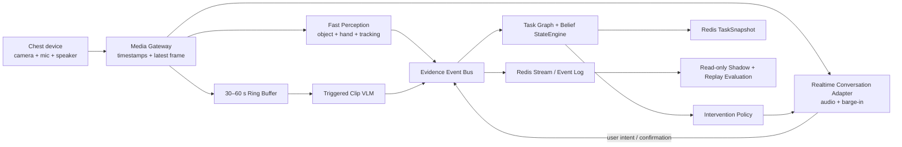

# NomaCook V2 Core Technical Architecture

> Status: Recommended clean-slate architecture, pending implementation review
> Date: 2026-08-09
> First vertical slice: move one tomato from a table into a refrigerator
> Audience: founders, engineers, technical reviewers, and AI coding agents

## 0. Thirty-second explanation

NomaCook is a chest-worn physical-task assistant. It continuously observes a bounded set of task-relevant objects and hand interactions, maintains an explicit belief about the user's current step, and speaks only when the user asks, the system becomes uncertain, or a meaningful deviation occurs.

The core pipeline is:

```text
camera + microphone
  -> media gateway
  -> task-bounded object and hand perception
  -> structured evidence events
  -> Task Graph + Belief State Engine
  -> intervention policy
  -> realtime conversation model
  -> Redis TaskSnapshot + append-only event memory
```

The most important rule is:

> Only the StateEngine may change task progress. CV, VLM, the realtime conversation model, user speech, memory workers, and evaluators only contribute evidence or suggestions.

Cooking is the first domain pack, not the product boundary. The same engine should later support repair, first-person quality inspection, makeup, and other observable physical tasks.

## 1. What the first assignment must prove

The first supported task is deliberately small:

> The user picks up a tomato from a table and places it inside a refrigerator.

The system should only pay attention to:

- the target tomato;
- one or two hands;
- the table region;
- the refrigerator, door, and visible interior region;
- the action chain `approach -> hold -> carry -> enter fridge -> release -> stable inside`.

It should ignore plates, utensils, unrelated food, appliances, and background activity unless a specific object becomes a known confuser.

The assignment is complete only when all of the following are true:

1. The tracked tomato crosses into the refrigerator-interior region.
2. The hand-to-tomato holding relation ends.
3. The tomato remains inside for a confirmation window.
4. No strong contradictory evidence shows the tomato leaving again.

Closing the refrigerator door is a follow-up instruction, not part of this assignment's completion condition.

## 2. Architecture at a glance



The system runs several loops at different speeds:

| Loop | Target cadence | Purpose |
|---|---:|---|
| Media ingest | device camera rate | Keep current audio and the newest usable frame |
| Fast CV | 5–15 FPS | Produce object, hand, relation, and region evidence |
| State update | every accepted event | Update task belief deterministically |
| Clip VLM | only on triggers | Resolve occlusion or semantic ambiguity |
| Realtime audio | continuous | Handle user speech, interruptions, and replies |
| Memory summary | after a transition/session | Create compact episodic memory asynchronously |
| Evaluation | shadow or replay | Measure performance without touching live state |

## 3. Component-by-component technology decisions

### 3.1 Chest device

**Job:** capture and play media. It is not an AI decision-maker.

Recommended responsibilities:

- capture JPEG frames initially, H.264 later if the hardware supports it reliably;
- capture mono PCM audio;
- play streaming PCM audio and expose playback reference audio for echo cancellation;
- attach monotonic timestamps and sequence numbers;
- maintain a small local outage buffer;
- expose a visible recording indicator and physical stop control.

Candidate hardware:

- ESP32-S3 camera board for the first wearable prototype;
- a phone or laptop webcam as the development source;
- a stronger camera/codec board only after measured ESP32 bandwidth or audio limitations.

The device sends no cloud API keys and never emits `STEP_COMPLETE`.

### 3.2 Media Gateway

**Job:** accept device media without allowing slow inference to block the connection.

Recommended stack:

- FastAPI + Uvicorn;
- WebSocket for the first ESP32 integration;
- optional LiveKit/WebRTC when browser/mobile transport, jitter handling, and production audio routing become important;
- `asyncio.Queue(maxsize=1)` or an atomic latest-frame slot for video;
- a 30–60 second ring buffer for event-triggered clip extraction.

Suggested endpoints:

```text
POST /v1/sessions
DELETE /v1/sessions/{session_id}
WS /ws/device/{session_id}
WS /ws/app/{session_id}
GET /v1/sessions/{session_id}/snapshot
GET /health/live
GET /health/ready
```

Useful FastAPI/Starlette APIs:

```python
@app.websocket("/ws/device/{session_id}")
await websocket.accept()
await websocket.receive_bytes()   # JPEG or PCM packet
await websocket.receive_json()    # control/heartbeat
await websocket.send_json(...)    # control and acknowledgements
```

Transport technique:

- audio packets are processed in order;
- video is latest-frame-wins;
- old unprocessed frames are dropped rather than queued;
- every packet carries `session_id`, `seq`, `device_ts_ms`, and media type.

[FastAPI WebSocket reference](https://fastapi.tiangolo.com/advanced/websockets/)

### 3.3 Realtime conversation layer

**Job:** make interaction natural. It does not own task state.

Create a provider-neutral interface:

```python
class RealtimeConversationAdapter:
    async def connect(session_config): ...
    async def send_audio(pcm_chunk): ...
    async def send_context(task_snapshot): ...
    async def cancel_response(): ...
    async def close(): ...
```

The first provider candidate is `qwen3.5-omni-flash-realtime`, with `qwen3.5-omni-plus-realtime` as an accuracy comparison. The provider choice must be decided by a small latency/tool-correctness benchmark, not by architecture.

For Qwen WebSocket integration, the relevant event sequence is:

```text
session.update
input_audio_buffer.append
input_image_buffer.append       # only for occasional contextual frames
input_audio_buffer.commit       # manual mode only
response.create                 # manual mode only
provider cancellation event + immediate local playback stop # adapter maps provider-specific semantics
```

With WebRTC, audio/video travel on RTP tracks and control events travel over the DataChannel. WebRTC only supports server-side VAD modes; WebSocket supports both server VAD and manual commit.

Use `semantic_vad` or server VAD for the first hands-free experiment. Measure false interruption rate in kitchen noise before selecting final thresholds.

The model receives only:

- the latest compact `TaskSnapshot`;
- the current instruction;
- the last few relevant events;
- one pending question, if any;
- occasional contextual frames, never the full session as its memory.

Allowed tools:

```text
get_task_snapshot()
emit_user_intent(intent, transcript)
answer_pending_question(question_id, answer, transcript)
request_instruction_repeat()
```

Forbidden tools:

```text
advance_step()
mark_complete()
change_threshold()
rewrite_task_graph()
run_self_evaluation()
```

Minimal system instruction:

```text
The latest TaskSnapshot is the only source of truth about task progress.
Never claim completion unless TaskSnapshot says the task is complete.
Speak only when the user asks or the Intervention Policy requests a response.
If evidence is uncertain, state what is missing and ask at most one question.
Convert user answers into evidence events; never treat them as direct state writes.
Stop speaking immediately when the user interrupts.
```

Qwen recommends approximately 1 FPS for video input and documents retained-context limits, so the realtime provider must not be used as the 10–20 minute task memory.

[Qwen Omni Realtime official documentation](https://www.alibabacloud.com/help/en/model-studio/realtime)
[LiveKit turn and interruption handling](https://docs.livekit.io/agents/logic/turns/)

### 3.4 Task-bounded object perception

**Job:** detect only objects relevant to the active step.

Do not permanently choose a detector by version number before a held-out comparison. The initial bakeoff should compare:

| Candidate | Why test it | Likely role |
|---|---|---|
| `yoloe-26n-seg.pt` | Small, current open-vocabulary segmentation candidate | Laptop/low-compute MVP |
| `yoloe-26s-seg.pt` | Better expected accuracy with text prompts | Server/GPU default candidate |
| `yolov8s-worldv2.pt` | Existing known baseline | Regression baseline |

YOLOE is the recommended clean-slate direction because it supports task-specific text prompts and returns segmentation masks. The model must still pass the NomaCook chest-camera holdout set before adoption.

Relevant Ultralytics API:

```python
from ultralytics import YOLOE

model = YOLOE("yoloe-26s-seg.pt")
model.set_classes(["tomato", "refrigerator", "open refrigerator"])
results = model.predict(frame, imgsz=640, conf=task_threshold)

boxes = results[0].boxes
masks = results[0].masks
```

The `TaskRecognitionContract` determines the prompt list. It should contain:

```text
active objects + destination + required confusers
```

It should not contain a broad kitchen vocabulary.

The detector output is converted into normalized observations:

```text
ObjectObservation(
  class_name,
  confidence,
  bbox_xyxy,
  mask,
  track_id,
  frame_id,
  timestamp_ms
)
```

[Ultralytics YOLOE documentation](https://docs.ultralytics.com/models/yoloe/)
[Ultralytics YOLO-World API](https://docs.ultralytics.com/models/yolo-world/)

### 3.5 Hand perception

**Job:** provide hand geometry, handedness, and movement anchors.

Recommended stack: MediaPipe Tasks `HandLandmarker`.

For deterministic recorded-video evaluation:

```python
options = HandLandmarkerOptions(
    base_options=BaseOptions(model_asset_path="hand_landmarker.task"),
    running_mode=VisionRunningMode.VIDEO,
    num_hands=2,
)
landmarker = HandLandmarker.create_from_options(options)
result = landmarker.detect_for_video(mp_image, timestamp_ms)
```

For a live non-blocking worker:

```python
options = HandLandmarkerOptions(
    base_options=BaseOptions(model_asset_path="hand_landmarker.task"),
    running_mode=VisionRunningMode.LIVE_STREAM,
    result_callback=on_hand_result,
)
landmarker = HandLandmarker.create_from_options(options)
landmarker.detect_async(mp_image, timestamp_ms)
```

MediaPipe returns 21 landmarks, handedness, image coordinates, and world coordinates. The relation layer derives:

- hand-object distance;
- mask/box overlap;
- grip closure;
- common motion over several frames;
- release candidate.

MediaPipe itself does not decide `holding` or task completion.

[MediaPipe Hand Landmarker Python guide](https://developers.google.com/edge/mediapipe/solutions/vision/hand_landmarker/python)

### 3.6 Tracking and hand-object relation fusion

**Job:** preserve identity across frames and turn raw observations into temporal evidence.

Candidate tracker:

- ByteTrack for a simple, replaceable baseline;
- BoT-SORT only if camera motion and re-identification tests show a real benefit;
- a task-specific single-object tracker later if general MOT adds unnecessary complexity.

Possible Ultralytics tracking call:

```python
results = model.track(
    frame,
    persist=True,
    tracker="bytetrack.yaml",
)
```

The fusion layer uses multi-frame hysteresis:

```text
raw relation -> candidate after K frames -> stable relation -> end after M misses
```

Example events:

```text
HAND_NEAR_STARTED(tomato)
HOLDING_STARTED(tomato)
OBJECT_MOVING_WITH_HAND(tomato)
HOLDING_ENDED(tomato)
OBJECT_STABLE_IN_REGION(tomato, refrigerator_interior)
```

Key techniques:

- exponential moving average for noisy distances;
- K-consecutive-frame confirmation;
- evidence TTL;
- explicit contradiction events;
- ROI intersection based on masks when available;
- velocity correlation between hand and object tracks.

[ByteTrack paper](https://arxiv.org/abs/2110.06864)

### 3.7 Triggered clip VLM

**Job:** answer one closed visual question when the fast loop is genuinely uncertain.

The VLM is called only when:

- a critical transition remains uncertain beyond a timeout;
- hand or refrigerator-door occlusion hides the release;
- CV evidence conflicts with a bound user confirmation;
- the user explicitly asks whether an action has completed.

Provider-neutral interface:

```python
class VLMConfirmer:
    async def confirm_clip(
        clip_bytes,
        completion_check,
        expected_objects,
        failure_modes,
        decision_context,
    ) -> VLMAssessment: ...
```

Every request carries:

```text
session_id
task_id
step_id
context_version
decision_id
clip_start_ms / clip_end_ms
closed completion question
```

Every response must be structured:

```json
{
  "answer": "yes | no | uncertain",
  "confidence": 0.0,
  "observed_evidence": [],
  "missing_evidence": []
}
```

The StateEngine rejects a response if the session, step, context version, decision ID, or TTL no longer matches. A VLM assessment is evidence, not truth.

### 3.8 Evidence contracts and event bus

**Job:** make every observation ordered, idempotent, and replayable.

Recommended schema layer: Pydantic immutable models.

```python
class EventEnvelope(BaseModel):
    model_config = ConfigDict(frozen=True)

    event_id: str
    session_id: str
    seq: int
    event_type: str
    device_ts_ms: int | None
    server_ts: datetime
    frame_id: str | None
    source: str
    confidence: float
    context_version: int
    payload: dict
```

Recommended event transport for the MVP:

- Redis Streams: `XADD` for append;
- `XREADGROUP` for StateEngine, memory worker, and shadow consumers;
- `XACK` after successful processing;
- `XRANGE` for replay by time/sequence;
- `MAXLEN` trimming for hot streams only;
- durable Postgres archive after or during the session.

Example Redis-py calls:

```python
event_id = await redis.xadd(stream_key, event_fields)
events = await redis.xreadgroup(
    groupname="state-engine",
    consumername=worker_id,
    streams={stream_key: ">"},
    count=20,
    block=100,
)
await redis.xack(stream_key, "state-engine", event_id)
```

The StateEngine must still deduplicate by `event_id`; Redis delivery semantics alone are not the business idempotency guarantee.

[Redis Streams documentation](https://redis.io/docs/latest/develop/data-types/streams/)

### 3.9 Task Graph and Belief StateEngine

**Job:** decide what the observations mean for the current task.

Primary API:

```python
class StateEngine:
    def consume(self, event: EventEnvelope) -> TaskSnapshot: ...
    def snapshot(self) -> TaskSnapshot: ...
    def restore(self, snapshot: TaskSnapshot) -> None: ...
```

Task Graph nodes include:

- correct states;
- allowed alternative transitions;
- background/irrelevant actions;
- recoverable deviations;
- critical deviations;
- recovery paths.

The first implementation should use an evidence-weighted belief score with:

- independent evidence-source requirements;
- consecutive-hit requirements;
- TTL and decay;
- contradiction/retraction;
- minimum dwell time for stable outcomes;
- candidate and confirmed states.

The engine outputs one of:

```text
ON_TRACK
UNCERTAIN
DEVIATING
CRITICAL
COMPLETE
```

It also outputs why:

```json
{
  "state": "TOMATO_IN_TRANSIT",
  "belief": 0.84,
  "status": "ON_TRACK",
  "supporting_evidence": ["holding", "shared_motion"],
  "missing_evidence": ["inside_fridge", "released"],
  "contradictions": [],
  "last_event_seq": 142,
  "context_version": 5
}
```

### 3.10 Intervention Policy

**Job:** decide whether the system should speak now.

The StateEngine classifies the task. The policy controls the user experience.

Speech triggers are limited to:

```text
TASK_STARTED
USER_ASKED
UNCERTAIN_TIMEOUT
DEVIATION_CONFIRMED
CRITICAL_RISK
RECOVERY_AVAILABLE
TASK_COMPLETE
```

Policy inputs:

- severity;
- confidence;
- recoverability;
- whether the user is currently speaking;
- time since the last intervention;
- whether the same issue has already been announced.

Policy techniques:

- cooldown per issue;
- deduplication key such as `(session_id, issue_type, step_id)`;
- one-question limit for uncertainty;
- critical messages preempt noncritical speech;
- ordinary on-track progress remains silent.

### 3.11 Session memory

**Job:** restore task state quickly without asking the model to remember the session.

| Tier | Stored data | Technology | Live path? |
|---|---|---|---:|
| L0 | last 30–60 seconds of media | RAM/local ring buffer | yes |
| L1 | latest TaskSnapshot and pending question | Redis Hash or RedisJSON | yes |
| L2 | complete ordered event stream | Redis Streams + Postgres archive | yes, append-only |
| L3 | step/session summaries | Postgres + optional embeddings | asynchronous |
| L4 | cross-session temporal skill memory | Graphiti-like temporal graph | later only |

Suggested Redis keys:

```text
noma:session:{session_id}:snapshot
noma:session:{session_id}:events
noma:session:{session_id}:pending_question
```

Relevant operations:

```python
await redis.hset(snapshot_key, mapping=snapshot_fields)
snapshot = await redis.hgetall(snapshot_key)
events = await redis.xrange(event_key, min=start_id, max="+")
```

Reconnect payload:

```text
latest TaskSnapshot
+ last 5–10 relevant events
+ current pending question
```

Postgres is for durable history and analytics, not for blocking every frame. A reasonable async client layer is SQLAlchemy `create_async_engine()` with asyncpg.

[SQLAlchemy asyncio documentation](https://docs.sqlalchemy.org/en/21/orm/extensions/asyncio.html)

### 3.12 Observability and evaluation

**Job:** measure reliability without turning the live agent into a self-testing agent.

Runtime metrics:

- frame ingest FPS and dropped frames;
- object/hand inference latency;
- event-to-state latency;
- VLM request rate and timeout rate;
- first-audio latency;
- barge-in stop latency;
- state transitions and rollbacks;
- unnecessary intervention count;
- false completion count.

Recommended tools:

- structured JSON logging;
- OpenTelemetry traces for `frame -> event -> snapshot -> speech`;
- Prometheus-compatible counters/histograms;
- session artifact writer for events, snapshots, interventions, and evaluation reports.

Evaluation has read-only subscriptions. It never receives the credentials or API route needed to emit live runtime commands.

## 4. Tomato-to-fridge: exact step-by-step execution

| Step | What happens | API / technique | Event emitted | State result | Speech behavior |
|---|---|---|---|---|---|
| 0. Start | User asks for help | Qwen `session.update`; create session API | `TASK_STARTED` | `READY` | Give one short instruction |
| 1. Locate | Tomato and fridge become visible | `YOLOE.set_classes()` + `predict()` | `OBJECTS_PRESENT` | `TOMATO_ON_TABLE` | Silent |
| 2. Approach | Hand moves close to tomato | MediaPipe `detect_async()` + distance EMA | `HAND_NEAR_STARTED` | `HAND_NEAR_TOMATO` | Silent |
| 3. Pick up | Grip closes and tomato moves with hand | landmarks + overlap + velocity correlation + K-frame hysteresis | `HOLDING_STARTED` | `TOMATO_HELD` | Silent |
| 4. Carry | Tomato leaves table and track follows hand | ByteTrack/persistent track + table ROI exit | `OBJECT_IN_TRANSIT` | `TOMATO_IN_TRANSIT` | Silent |
| 5. Reach fridge | Fridge/interior appears and hand approaches | YOLOE mask/box + refrigerator ROI | `DESTINATION_INTERACTION` | `FRIDGE_INTERACTION` | Silent unless wrong destination |
| 6. Enter | Tomato crosses interior boundary | mask-to-ROI intersection over multiple frames | `OBJECT_ENTERED_REGION` | `CANDIDATE_INSIDE_FRIDGE` | Silent |
| 7. Release | Holding ends while tomato remains inside | hand-object separation + grip/open + stable object track | `HOLDING_ENDED` | `TOMATO_RELEASED_INSIDE` | Silent |
| 8. Confirm | Tomato stays inside for dwell window | StateEngine timer + no contradiction; clip VLM only if occluded | `TASK_COMPLETE` | `CONFIRMED_COMPLETE` | “Done. Remember to close the fridge.” |

### 4.1 Occlusion fallback

If step 6 or 7 is hidden by the refrigerator door:

1. StateEngine enters `UNCERTAIN`, not `COMPLETE`.
2. It waits for more fast-loop evidence.
3. After the uncertainty timeout, it extracts a 2–4 second clip from the ring buffer.
4. `VLMConfirmer.confirm_clip()` asks one closed question.
5. A current, matching VLM assessment becomes another evidence event.
6. If the belief is still insufficient, Intervention Policy asks the user one question.

### 4.2 Wrong-object fallback

If the user picks up a red package instead:

1. visual prompt/confuser evidence says target identity is inconsistent;
2. StateEngine retains the previous stable step;
3. `DEVIATION_CONFIRMED` is emitted only after multi-frame confirmation;
4. the model says once: “Please pick up the tomato on the table.”

### 4.3 User-confirmation fallback

If the user says, “I already put it in”:

- the conversation model emits `USER_CONFIRMATION` bound to the current pending question;
- the confirmation is weighted evidence;
- it can close a small visibility gap when the system observed the preceding action chain;
- it cannot complete the task if the system observed none of the pickup, transit, or refrigerator interaction.

## 5. Execute-first runtime design

| Mode | Reads live media | Writes live task state | Speaks | Purpose |
|---|---:|---:|---:|---|
| `RUN` | yes | StateEngine only | Intervention Policy only | Execute the active task |
| `SHADOW` | mirrored feed/events | no | no | Compare an experimental model |
| `REPLAY_EVAL` | recorded sessions | no | no | Offline metrics and tuning |

Required invariants:

1. `RUN` never waits for shadow evaluation.
2. Experimental events carry `shadow=true`; StateEngine rejects them.
3. Model, prompt, threshold, and Task Graph version are frozen when a session starts.
4. Runtime health checks test liveness, latency, queue depth, and provider availability only.
5. Capability testing, prompt comparison, and threshold search occur before deployment or in replay.
6. The evaluator has no `RuntimeCommand` producer credentials.
7. Failures degrade to `UNCERTAIN`, not an invented completion.

## 6. Build and validation sequence

### Phase 0: Freeze contracts

Deliver:

- `TaskRecognitionContract`;
- `EventEnvelope`;
- `TaskSnapshot`;
- tomato-to-fridge Task Graph;
- ground-truth annotation guide;
- golden event logs.

Do not connect a realtime model yet.

### Phase 1: Record and label

Record at least 30 development sessions:

- 10 normal runs;
- 10 runs with occlusion, speed changes, lighting changes, and distractors;
- 10 deliberate deviations and recoveries.

Keep a separate holdout acceptance set that is never used to tune thresholds.

### Phase 2: Detector bakeoff

Run the same labeled clips through YOLOE-26n, YOLOE-26s, and YOLO-Worldv2.

Measure:

- target-object precision/recall;
- refrigerator/interior localization quality;
- mask quality for ROI crossing;
- p50/p95 latency on the target machine;
- stability under occlusion and motion blur.

Select the smallest model that passes the false-evidence and latency gates.

### Phase 3: Evidence and deterministic replay

Validate:

- hand-near;
- holding start/end;
- shared motion;
- table exit;
- refrigerator entry;
- stable release inside.

Replay duplicates, out-of-order events, stale VLM responses, contradictions, and reconnects. The same event log must always produce the same snapshot sequence.

### Phase 4: Silent live run

Run the full camera-to-StateEngine pipeline without speech. Use a developer status view to compare predicted state with the human label.

### Phase 5: Read-only realtime conversation

Connect Qwen or another provider to audio, barge-in, `get_task_snapshot`, and user-intent tools. Do not expose task-state write tools.

### Phase 6: Integrated acceptance

Lock 24 end-to-end runs:

- 8 standard runs;
- 8 natural variation/occlusion runs;
- 8 deviation/recovery runs.

Proposed MVP gates:

| Metric | Gate |
|---|---:|
| False task completion | 0 / 24 |
| Correct completion on valid runs | at least 15 / 16 |
| Deviation detected or clarified | at least 7 / 8 |
| Unnecessary spoken interventions | no more than 1 per successful run |
| State update after decisive fast evidence | p95 below 500 ms |
| First speech audio | p95 below 1.2 s on target network |
| Barge-in playback stop | p95 below 300 ms |
| Reconnect state restoration | below 2 s after transport recovery |
| Evaluator writes to live state | exactly 0 |

These are engineering gates for the vertical slice, not a statistical product-safety guarantee.

### Phase 7: Soak and failure tests

Run 20–30 minute sessions with:

- temporary network loss;
- realtime provider timeout;
- VLM timeout;
- camera reconnect;
- pause and resume;
- fast and slow users;
- left- and right-handed execution.

There must be no infinite retry, cross-session state leak, queued-video lag, or repeated speech loop.

## 7. Proposed software boundaries

```text
server/
  gateway/          # sessions, WebSockets, media ingest
  contracts/        # TaskContract, EventEnvelope, TaskSnapshot
  perception/       # detector, hands, tracker, relations, ROI
  vlm/              # triggered clip confirmation adapter
  engine/           # task graph, belief, state transitions
  intervention/     # when and what to say
  voice/            # realtime conversation provider adapters
  memory/           # Redis hot state, streams, archive worker
  observability/    # metrics, traces, session artifacts
  eval/             # replay and shadow only

domain_packs/
  kitchen/
    tomato_to_fridge.yaml
    objects.yaml
    deviations.yaml
    prompts.yaml
```

Each directory exposes a narrow interface. Provider-specific Qwen or Gemini event handling belongs under `voice/adapters`, not inside StateEngine. Detector-specific YOLO parsing belongs under `perception/adapters`, not inside the Task Graph.

## 8. Research-to-component map

| Research | Architecture decision it supports |
|---|---|
| [HoloAssist](https://arxiv.org/abs/2309.17024) | Separate mistake detection from intervention timing; collect mistake and recovery data |
| [PREGO](https://openaccess.thecvf.com/content/CVPR2024/html/Flaborea_PREGO_Online_Mistake_Detection_in_PRocedural_EGOcentric_Videos_CVPR_2024_paper.html) | Combine online perception with symbolic expected-step reasoning |
| [Generalized Task Graph](https://openaccess.thecvf.com/content/ICCV2025/html/Lee_Error_Recognition_in_Procedural_Videos_using_Generalized_Task_Graph_ICCV_2025_paper.html) | Encode background actions, legal variation, errors, and recovery branches |
| [CaptainCook4D](https://arxiv.org/abs/2312.14556) | Build cooking error taxonomies and initial offline benchmarks |
| [Live MLLM Task Guidance](https://arxiv.org/abs/2511.21998) | Do not let a general MLLM own continuous task state |
| [Hand-Object Contact and Object State](https://openaccess.thecvf.com/content/WACV2024/html/Shiota_Egocentric_Action_Recognition_by_Capturing_Hand-Object_Contact_and_Object_State_WACV_2024_paper.html) | Model contact and state changes, not object presence alone |
| [EgoLife](https://arxiv.org/abs/2503.03803) | Separate egocentric perception from long-context retrieval memory |
| [MemGPT](https://arxiv.org/abs/2310.08560) | Use working, event, and episodic memory tiers |
| [Graphiti](https://arxiv.org/abs/2501.13956) | Reserve temporal knowledge graphs for later cross-session memory |
| [Moshi](https://arxiv.org/abs/2410.00037) | Treat full-duplex speech, first-audio latency, and interruption as product metrics |
| [StreamingLLM](https://arxiv.org/abs/2309.17453) and [PagedAttention](https://arxiv.org/abs/2309.06180) | Use KV-cache techniques for serving optimization, never as task memory |

## 9. Explicit decisions

- Use a hybrid event-first architecture, not a pure Omni/VLM loop.
- Benchmark YOLOE-26n/26s against YOLO-Worldv2 before selecting the detector.
- Use MediaPipe hands as a geometry/evidence source, not an action oracle.
- Use a replaceable tracker and temporal relation layer.
- Use short-clip VLM confirmation only on triggers.
- Let only StateEngine advance or roll back task state.
- Keep the realtime conversation model read-only with respect to task progress.
- Keep `RUN`, `SHADOW`, and `REPLAY_EVAL` isolated.
- Use Redis for hot state and event fan-out, with durable archival outside the critical perception loop.
- Treat cooking as the first domain pack and preserve generic Task/Event/State interfaces.

## 10. What not to build yet

- full-recipe cooking recognition;
- exact seasoning quantity or doneness estimation;
- a knowledge graph in the live decision path;
- autonomous online prompt/threshold tuning;
- a broad all-kitchen detector vocabulary;
- end-to-end learned action recognition before collecting enough first-person error data;
- a polished consumer UI before the 24-run acceptance gate passes.

## 11. Source of truth and next artifact

This document is the high-level implementation-oriented architecture reference. The narrower vertical-slice acceptance design is:

- `docs/superpowers/specs/2026-08-09-tomato-to-fridge-vertical-slice-design.md`

After this architecture is approved, the next artifact should be an implementation plan that breaks Phases 0–7 into exact files, tests, commands, and acceptance checkpoints. No implementation should begin from this document alone without that plan.
