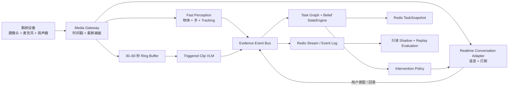

# NomaCook V2 核心技术架构

> 状态：推荐的全新架构方案，等待实现前评审
> 日期：2026-08-09
> 第一个垂直任务：把桌上的一个番茄放进冰箱
> 读者：创始团队、工程师、技术评审者，以及需要快速理解 NomaCook 的 AI

## 0. 三十秒说明

NomaCook 是一个佩戴在胸前、辅助用户完成现实任务的 AI。它不会试图理解画面中的所有东西，而是只持续观察当前任务需要的少量物体、手部动作和关键位置；系统会维护一个明确的“用户现在做到哪一步”的状态，并且只在用户提问、系统不确定、发现明显偏离或任务完成时说话。

核心流程是：

```text
摄像头 + 麦克风
  -> Media Gateway（媒体接入）
  -> 受任务限制的物体、手部与动作感知
  -> 结构化 Evidence Event（证据事件）
  -> Task Graph + Belief StateEngine（任务图与状态判断）
  -> Intervention Policy（是否需要说话）
  -> 实时对话模型
  -> Redis TaskSnapshot + 追加式 Event Log（任务记忆）
```

最重要的架构规则是：

> 只有 StateEngine 可以改变任务进度。CV、VLM、实时对话模型、用户语音、记忆 worker 和评估系统都只能提供证据或建议，不能直接宣布某一步完成。

厨房只是第一个 domain pack，而不是产品边界。同一套 Task/Event/State 软件层以后可以扩展到维修、第一人称质量检测、化妆和其他可以通过视觉观察的现实任务。

## 1. 第一个任务要证明什么

第一个支持的任务刻意保持简单：

> 用户拿起桌上的一个番茄，把它放进冰箱。

系统只需要关注：

- 目标番茄；
- 一只或两只手；
- 桌面区域；
- 冰箱、冰箱门和可见的冰箱内部区域；
- 动作链：`接近 -> 拿住 -> 搬运 -> 进入冰箱 -> 松手 -> 稳定留在里面`。

盘子、餐具、其他食物、电器和背景活动默认都被忽略。只有当某件东西经常被误认成番茄时，才把它加入当前任务的 `confusers` 列表。

只有同时满足以下条件，任务才算完成：

1. 被持续追踪的番茄进入冰箱内部区域；
2. 手与番茄之间的持握关系结束；
3. 番茄在冰箱内停留超过确认时间窗；
4. 没有强证据表明番茄随后又被拿出。

“关上冰箱门”是任务完成后的提醒，不属于这个 assignment 的完成条件。

## 2. 整体架构



系统不是让一个大模型从头到尾盯着视频，而是同时运行几条不同速度的 loop：

| Loop | 频率 | 作用 |
|---|---:|---|
| 音频与播放 | 20–50 Hz 数据包 | 保证实时对话、插话和立即停止播放 |
| 快速视觉 | 5–15 FPS | 找到目标物体、手、位置关系和明显动作变化 |
| StateEngine | 每个证据事件触发 | 更新当前步骤、置信度和偏离状态 |
| VLM 确认 | 只在触发时 | 对遮挡或矛盾片段回答一个封闭问题 |
| 记忆写入 | 事件驱动 / 异步 | 保存快照、event log 和 session summary |
| Shadow / Replay | 非实时主链路 | 比较模型、调参数和做回归测试 |

这套拆分解决四个核心问题：

1. **低延迟**：普通动作由本地或服务器端小模型快速判断，不等待大模型看完整视频。
2. **准确性**：完成状态来自多帧、多来源证据，而不是单帧分类。
3. **长期记忆**：10–20 分钟任务由结构化状态和 event log 保存，不依靠模型 context 记忆。
4. **可扩展性**：更换厨房、维修或化妆任务时，主要替换 Task Contract 和 Task Graph，而不是重做整个系统。

### 2.1 各模块的权限边界

| 模块 | 可以做什么 | 不可以做什么 |
|---|---|---|
| CV / Hand / Tracker | 产生观察和关系证据 | 宣布步骤完成 |
| Triggered VLM | 回答一个具体视觉问题 | 自己推进任务 |
| Realtime LLM | 对话、解释、提取用户意图 | 修改 task state 或 threshold |
| StateEngine | 根据证据推进、保持或回退状态 | 自己修改模型和 prompt |
| Intervention Policy | 决定是否说话、说什么类型的话 | 改变任务事实 |
| Memory | 保存和恢复已确认状态 | 把旧记忆当作当前观察 |
| Evaluation | 离线衡量表现 | 写入 live runtime |

## 3. 每个组件用什么技术

### 3.1 胸前设备

**作用：**采集和播放媒体，不负责做 AI 决策。

建议职责：

- 第一版发送 JPEG frame；硬件和网络稳定后再考虑 H.264；
- 采集单声道 PCM audio；
- 播放 streaming PCM，并提供 playback reference 以支持 echo cancellation；
- 给每个 packet 添加单调时间戳和 sequence number；
- 网络短暂中断时保留一个很小的本地 buffer；
- 提供明显的录制指示灯和物理停止按钮。

候选硬件：

- 第一版 wearable prototype：ESP32-S3 camera board；
- 开发和模型测试：手机或 laptop webcam；
- 只有在测试证明 ESP32 的 bandwidth、codec 或 audio 能力不够后，才升级更强硬件。

设备上不保存 cloud API key，也永远不能产生 `STEP_COMPLETE`。

### 3.2 Media Gateway

**作用：**稳定接收设备媒体，并确保慢速推理不会堵塞连接。

推荐技术：

- FastAPI + Uvicorn；
- 第一版 ESP32 使用 WebSocket；
- 当需要 browser/mobile、多端连接、jitter handling 和更成熟的 audio routing 时，再引入 LiveKit/WebRTC；
- video 使用 `asyncio.Queue(maxsize=1)` 或 atomic latest-frame slot；
- RAM 中维护 30–60 秒 ring buffer，用于截取触发式 VLM clip。

建议 endpoint：

```text
POST /v1/sessions
DELETE /v1/sessions/{session_id}
WS /ws/device/{session_id}
WS /ws/app/{session_id}
GET /v1/sessions/{session_id}/snapshot
GET /health/live
GET /health/ready
```

FastAPI/Starlette 关键 API：

```python
@app.websocket("/ws/device/{session_id}")
await websocket.accept()
await websocket.receive_bytes()   # JPEG 或 PCM packet
await websocket.receive_json()    # control / heartbeat
await websocket.send_json(...)    # control / acknowledgement
```

传输规则：

- audio packet 按顺序处理；
- video 使用 `latest-frame-wins`；
- 来不及处理的旧画面直接丢弃，不能排成长队列；
- 每个 packet 包含 `session_id`、`seq`、`device_ts_ms` 和 media type。

[FastAPI WebSocket 官方文档](https://fastapi.tiangolo.com/advanced/websockets/)

### 3.3 实时对话层

**作用：**让语音交互自然、可打断。它不负责判断任务完成。

先定义 provider-neutral adapter：

```python
class RealtimeConversationAdapter:
    async def connect(session_config): ...
    async def send_audio(pcm_chunk): ...
    async def send_context(task_snapshot): ...
    async def cancel_response(): ...
    async def close(): ...
```

第一候选是 `qwen3.5-omni-flash-realtime`，同时用 `qwen3.5-omni-plus-realtime` 做准确率对照。最终选哪个 provider，必须通过小规模 latency、barge-in 和 tool-calling benchmark 决定，架构本身不能绑定某个模型。

Qwen WebSocket 主要事件：

```text
session.update
input_audio_buffer.append
input_image_buffer.append       # 只传偶尔需要的上下文画面
input_audio_buffer.commit       # 仅 manual mode
response.create                 # 仅 manual mode
provider cancellation event + 立即停止本地播放
```

如果使用 WebRTC：

- audio/video 通过 RTP track；
- control event 通过 DataChannel；
- WebRTC 只支持 server-side VAD；
- WebSocket 同时支持 server VAD 和 manual commit。

第一轮 hands-free 实验可以使用 `semantic_vad` 或 server VAD，但必须在真实厨房噪声中测量误打断率，再确定 threshold。

实时模型只能收到：

- 最新的精简版 `TaskSnapshot`；
- 当前 instruction；
- 最近几个相关 event；
- 如果存在，当前唯一的 pending question；
- 偶尔的一张上下文 frame，而不是整个 session video。

允许给模型的 tools：

```text
get_task_snapshot()
emit_user_intent(intent, transcript)
answer_pending_question(question_id, answer, transcript)
request_instruction_repeat()
```

禁止给模型的 tools：

```text
advance_step()
mark_complete()
change_threshold()
rewrite_task_graph()
run_self_evaluation()
```

最小 system instruction：

```text
最新的 TaskSnapshot 是任务进度唯一的事实来源。
除非 TaskSnapshot 明确为 COMPLETE，否则不能声称任务已完成。
只有用户提问或 Intervention Policy 请求回复时才说话。
证据不足时，说明缺少什么，并且最多只问一个问题。
用户回答只能转换成 evidence event，不能直接修改 task state。
用户插话时立即停止说话。
```

Qwen 官方建议视频输入约 1 FPS，并且 realtime context 有保留上限，所以它不能承担 10–20 分钟的任务记忆。

[Qwen Omni Realtime 官方文档](https://www.alibabacloud.com/help/en/model-studio/realtime)
[LiveKit Turn 与打断处理](https://docs.livekit.io/agents/logic/turns/)

### 3.4 受任务限制的物体感知

**作用：**只检测当前步骤真正需要的物体。

不要在测试前先凭版本号决定 detector。第一轮 bakeoff 比较：

| 候选模型 | 为什么测试 | 可能的角色 |
|---|---|---|
| `yoloe-26n-seg.pt` | 较小、支持 open-vocabulary segmentation | laptop / 低算力 MVP |
| `yoloe-26s-seg.pt` | 预计准确率更高，也支持 text prompt | server/GPU 默认候选 |
| `yolov8s-worldv2.pt` | 项目已有的已知 baseline | regression baseline |

全新架构优先测试 YOLOE，因为它支持任务限定的 text prompt，并且可以输出 segmentation mask。但只有在 NomaCook 自己的胸前视角 holdout set 通过后，才能正式采用。

Ultralytics 关键 API：

```python
from ultralytics import YOLOE

model = YOLOE("yoloe-26s-seg.pt")
model.set_classes(["tomato", "refrigerator", "open refrigerator"])
results = model.predict(frame, imgsz=640, conf=task_threshold)

boxes = results[0].boxes
masks = results[0].masks
```

`TaskRecognitionContract` 决定 prompt list：

```text
当前步骤需要的物体 + 目的地 + 已知易混淆物
```

它不应该包含完整 kitchen vocabulary。

Detector output 统一转换成：

```text
ObjectObservation(
  class_name,
  confidence,
  bbox_xyxy,
  mask,
  track_id,
  frame_id,
  timestamp_ms
)
```

[Ultralytics YOLOE 文档](https://docs.ultralytics.com/models/yoloe/)
[Ultralytics YOLO-World API](https://docs.ultralytics.com/models/yolo-world/)

### 3.5 手部感知

**作用：**提供手部位置、handedness 和运动锚点。

推荐使用 MediaPipe Tasks `HandLandmarker`。

录制视频的 deterministic evaluation：

```python
options = HandLandmarkerOptions(
    base_options=BaseOptions(model_asset_path="hand_landmarker.task"),
    running_mode=VisionRunningMode.VIDEO,
    num_hands=2,
)
landmarker = HandLandmarker.create_from_options(options)
result = landmarker.detect_for_video(mp_image, timestamp_ms)
```

Live non-blocking worker：

```python
options = HandLandmarkerOptions(
    base_options=BaseOptions(model_asset_path="hand_landmarker.task"),
    running_mode=VisionRunningMode.LIVE_STREAM,
    result_callback=on_hand_result,
)
landmarker = HandLandmarker.create_from_options(options)
landmarker.detect_async(mp_image, timestamp_ms)
```

MediaPipe 返回 21 个 landmarks、handedness、image coordinates 和 world coordinates。Relation layer 再从中计算：

- hand-object distance；
- mask/box overlap；
- grip closure；
- 连续多帧的共同运动；
- release candidate。

MediaPipe 本身不能直接决定 `holding`，更不能决定任务完成。

[MediaPipe Hand Landmarker Python 文档](https://developers.google.com/edge/mediapipe/solutions/vision/hand_landmarker/python)

### 3.6 Tracking 与手和物体的关系融合

**作用：**在不同 frame 之间保持物体 identity，并把单帧观察转成连续动作证据。

Tracker 候选：

- ByteTrack：简单、容易替换，适合作为第一版 baseline；
- BoT-SORT：只有测试证明 camera motion 和 re-identification 明显受益时才采用；
- task-specific single-object tracker：以后如果通用 MOT 过重，可以为单个目标单独优化。

Ultralytics tracking 示例：

```python
results = model.track(
    frame,
    persist=True,
    tracker="bytetrack.yaml",
)
```

Fusion layer 使用 multi-frame hysteresis：

```text
raw relation
  -> 连续 K 帧后成为 candidate
  -> stable relation
  -> 连续 M 次缺失后才结束
```

输出的 evidence event 示例：

```text
HAND_NEAR_STARTED(tomato)
HOLDING_STARTED(tomato)
OBJECT_MOVING_WITH_HAND(tomato)
HOLDING_ENDED(tomato)
OBJECT_STABLE_IN_REGION(tomato, refrigerator_interior)
```

关键 technique：

- exponential moving average，平滑距离抖动；
- K-consecutive-frame confirmation；
- evidence TTL；
- 显式 contradiction event；
- 有 mask 时使用 ROI intersection，而不是只看 box center；
- 比较 hand track 与 object track 的 velocity correlation。

[ByteTrack 论文](https://arxiv.org/abs/2110.06864)

### 3.7 触发式短片 VLM

**作用：**只有快速视觉链路真的无法确认时，才让 VLM 回答一个封闭的视觉问题。

只在以下情况调用：

- 关键状态超过 timeout 仍然不确定；
- 手或冰箱门遮住了松手瞬间；
- CV 证据与用户针对当前问题的确认互相冲突；
- 用户明确询问某个动作是否完成。

Provider-neutral interface：

```python
class VLMConfirmer:
    async def confirm_clip(
        clip_bytes,
        completion_check,
        expected_objects,
        failure_modes,
        decision_context,
    ) -> VLMAssessment: ...
```

每个 request 包含：

```text
session_id
task_id
step_id
context_version
decision_id
clip_start_ms / clip_end_ms
封闭式 completion question
```

Response 必须是 structured output：

```json
{
  "answer": "yes | no | uncertain",
  "confidence": 0.0,
  "observed_evidence": [],
  "missing_evidence": []
}
```

如果 response 的 session、step、context version、decision ID 或 TTL 已经过期，StateEngine 必须拒绝。VLM assessment 只是另一条 evidence，不是事实本身。

### 3.8 Evidence Contract 与 Event Bus

**作用：**确保所有观察都有顺序、可以去重、可以重放。

Schema 推荐使用 immutable Pydantic model：

```python
class EventEnvelope(BaseModel):
    model_config = ConfigDict(frozen=True)

    event_id: str
    session_id: str
    seq: int
    event_type: str
    device_ts_ms: int | None
    server_ts: datetime
    frame_id: str | None
    source: str
    confidence: float
    context_version: int
    payload: dict
```

MVP event transport 推荐 Redis Streams：

- `XADD`：追加 event；
- `XREADGROUP`：StateEngine、memory worker 和 shadow consumer 独立消费；
- `XACK`：成功处理后确认；
- `XRANGE`：按照时间或 sequence replay；
- `MAXLEN`：只裁剪 hot stream；
- session 中或 session 结束后异步写入 durable Postgres archive。

Redis-py 示例：

```python
event_id = await redis.xadd(stream_key, event_fields)
events = await redis.xreadgroup(
    groupname="state-engine",
    consumername=worker_id,
    streams={stream_key: ">"},
    count=20,
    block=100,
)
await redis.xack(stream_key, "state-engine", event_id)
```

StateEngine 仍然必须根据 `event_id` 去重。Redis 的 delivery semantics 不能代替业务层 idempotency。

[Redis Streams 官方文档](https://redis.io/docs/latest/develop/data-types/streams/)

### 3.9 Task Graph 与 Belief StateEngine

**作用：**判断这些观察对于当前任务意味着什么。

核心 API：

```python
class StateEngine:
    def consume(self, event: EventEnvelope) -> TaskSnapshot: ...
    def snapshot(self) -> TaskSnapshot: ...
    def restore(self, snapshot: TaskSnapshot) -> None: ...
```

Task Graph node 包含：

- 正确状态；
- 合法的 alternative transition；
- background / irrelevant action；
- recoverable deviation；
- critical deviation；
- recovery path。

第一版采用 evidence-weighted belief score，并包含：

- 至少两个独立 evidence source 的要求；
- consecutive-hit requirement；
- TTL 与 decay；
- contradiction / retraction；
- stable outcome 的 minimum dwell time；
- candidate state 与 confirmed state 分离。

Engine 对外输出：

```text
ON_TRACK
UNCERTAIN
DEVIATING
CRITICAL
COMPLETE
```

同时输出原因，而不只是一个 label：

```json
{
  "state": "TOMATO_IN_TRANSIT",
  "belief": 0.84,
  "status": "ON_TRACK",
  "supporting_evidence": ["holding", "shared_motion"],
  "missing_evidence": ["inside_fridge", "released"],
  "contradictions": [],
  "last_event_seq": 142,
  "context_version": 5
}
```

### 3.10 Intervention Policy

**作用：**决定系统现在是否应该说话。

StateEngine 判断任务状态，Intervention Policy 控制用户体验。允许触发语音的事件只有：

```text
TASK_STARTED
USER_ASKED
UNCERTAIN_TIMEOUT
DEVIATION_CONFIRMED
CRITICAL_RISK
RECOVERY_AVAILABLE
TASK_COMPLETE
```

Policy input：

- severity；
- confidence；
- recoverability；
- 用户是否正在说话；
- 距离上次 intervention 的时间；
- 同一个问题是否已经提醒过。

关键 technique：

- 每类问题独立 cooldown；
- 使用 `(session_id, issue_type, step_id)` 做 deduplication key；
- uncertainty 最多问一个问题；
- critical message 可以打断 noncritical speech；
- 用户正常推进时保持安静。

### 3.11 10–20 分钟 Session Memory

**作用：**快速恢复任务状态，而不是让 LLM 记住整个 session。

| 层级 | 保存内容 | 技术 | 是否进入 live path |
|---|---|---|---:|
| L0 | 最近 30–60 秒媒体 | RAM / local ring buffer | 是 |
| L1 | 最新 TaskSnapshot、pending question | Redis Hash 或 RedisJSON | 是 |
| L2 | 完整有序 event stream | Redis Streams + Postgres archive | 是，append-only |
| L3 | step/session summary | Postgres + optional embeddings | 异步 |
| L4 | 跨 session 的 temporal skill memory | Graphiti-like temporal graph | 以后再做 |

建议 Redis key：

```text
noma:session:{session_id}:snapshot
noma:session:{session_id}:events
noma:session:{session_id}:pending_question
```

关键 operation：

```python
await redis.hset(snapshot_key, mapping=snapshot_fields)
snapshot = await redis.hgetall(snapshot_key)
events = await redis.xrange(event_key, min=start_id, max="+")
```

断线重连只需要加载：

```text
最新 TaskSnapshot
+ 最近 5–10 个相关 event
+ 当前 pending question
```

Postgres 用于 durable history 和 analytics，不应该阻塞每一帧。异步 client 可以使用 SQLAlchemy `create_async_engine()` + asyncpg。

[SQLAlchemy asyncio 文档](https://docs.sqlalchemy.org/en/21/orm/extensions/asyncio.html)

#### Live event 与长期记忆如何并行

```text
CV / Voice / VLM
      |
      v
Redis Stream  ----------------------> Async Archive Worker -> Postgres
      |
      +----> StateEngine -> Redis TaskSnapshot
      |
      +----> Shadow / Metrics Consumer（只读）
```

- Live path 只处理新 event 和当前 snapshot，因此 latency 不会随着 session 变长而线性增加；
- 每个 event 先进入 append-only stream，StateEngine 再消费并产生新 snapshot；
- Archive worker 与 live decision 并行，写库变慢不能阻塞视觉判断；
- LLM 只拿 compact snapshot 和少量相关 event，不读取整段 history；
- 需要回溯时，先查 snapshot，再按 sequence 从 event log 补充，而不是重新处理完整视频；
- KV cache 可以降低模型推理 latency，但它是 serving optimization，不是可靠的 task memory。

### 3.12 Observability 与 Evaluation

**作用：**衡量可靠性，但不能让 live agent 一边执行一边改自己。

Runtime metric：

- frame ingest FPS 与 dropped frame；
- object/hand inference latency；
- event-to-state latency；
- VLM request rate 与 timeout rate；
- first-audio latency；
- barge-in stop latency；
- state transition 与 rollback；
- unnecessary intervention count；
- false completion count。

推荐工具：

- structured JSON logging；
- OpenTelemetry trace：`frame -> event -> snapshot -> speech`；
- Prometheus-compatible counter/histogram；
- session artifact writer，保存 event、snapshot、intervention 和 evaluation report。

Evaluation 只能 read-only subscribe。它不应该拿到任何能够发送 live runtime command 的 credential 或 API route。

## 4. Tomato-to-fridge：逐步执行过程

| 步骤 | 发生什么 | API / technique | 产生的 event | StateEngine 状态 | 是否说话 |
|---|---|---|---|---|---|
| 0. 开始 | 用户请求帮助 | `POST /v1/sessions`；Qwen `session.update` | `TASK_STARTED` | `READY` | 给一句简短 instruction |
| 1. 找到目标 | 画面中出现番茄和冰箱 | `YOLOE.set_classes()` + `predict()` | `OBJECTS_PRESENT` | `TOMATO_ON_TABLE` | 安静 |
| 2. 手靠近 | 手逐渐接近番茄 | MediaPipe `detect_async()` + distance EMA | `HAND_NEAR_STARTED` | `HAND_NEAR_TOMATO` | 安静 |
| 3. 拿起 | 手收紧，番茄与手共同移动 | landmarks + overlap + velocity correlation + K-frame hysteresis | `HOLDING_STARTED` | `TOMATO_HELD` | 安静 |
| 4. 搬运 | 番茄离开桌面，并继续跟随手移动 | ByteTrack / persistent track + table ROI exit | `OBJECT_IN_TRANSIT` | `TOMATO_IN_TRANSIT` | 安静 |
| 5. 到冰箱 | 识别冰箱内部，手接近目的地 | YOLOE mask/box + refrigerator ROI | `DESTINATION_INTERACTION` | `FRIDGE_INTERACTION` | 除非目的地错误，否则安静 |
| 6. 进入 | 番茄跨过冰箱内部边界 | 连续多帧 mask-to-ROI intersection | `OBJECT_ENTERED_REGION` | `CANDIDATE_INSIDE_FRIDGE` | 安静 |
| 7. 松手 | 手离开番茄，番茄仍留在里面 | hand-object separation + grip/open + stable track | `HOLDING_ENDED` | `TOMATO_RELEASED_INSIDE` | 安静 |
| 8. 确认 | 番茄在冰箱内稳定停留 | StateEngine dwell timer + no contradiction；遮挡时才用 clip VLM | `TASK_COMPLETE` | `CONFIRMED_COMPLETE` | “完成了，记得关冰箱门。” |

### 4.1 遮挡处理

如果冰箱门遮住步骤 6 或步骤 7：

1. StateEngine 进入 `UNCERTAIN`，不能直接进入 `COMPLETE`；
2. 先等待更多 fast-loop evidence；
3. 超过 uncertainty timeout 后，从 ring buffer 截取 2–4 秒 clip；
4. `VLMConfirmer.confirm_clip()` 只问一个封闭问题；
5. 只有仍然匹配当前 decision context 的 VLM response 才变成 evidence event；
6. 如果证据仍然不够，Intervention Policy 才向用户问一个问题。

### 4.2 拿错物体

如果用户拿起的是一个红色包装袋：

1. target identity 与 confuser evidence 出现冲突；
2. StateEngine 保留上一个 confirmed state；
3. 连续多帧确认后才产生 `DEVIATION_CONFIRMED`；
4. 系统只提醒一次：“请拿桌上的番茄。”

### 4.3 用户口头确认

如果用户说“我已经放进去了”：

- 对话模型产生与当前 pending question 绑定的 `USER_CONFIRMATION`；
- 这条确认是有权重的 evidence；
- 如果系统已经看到拿起、搬运和冰箱交互，它可以补足很小的视觉缺口；
- 如果系统完全没有观察到前面的动作链，单独一句用户确认不能完成任务。

## 5. 如何确保 AI 以 Execute 为主

| 模式 | 读取 live media | 写入 live task state | 可以说话 | 用途 |
|---|---:|---:|---:|---|
| `RUN` | 是 | 只有 StateEngine | 只有 Intervention Policy | 执行当前任务 |
| `SHADOW` | mirrored feed/event | 否 | 否 | 比较实验模型 |
| `REPLAY_EVAL` | recorded session | 否 | 否 | 离线评估和调参 |

必须满足的 invariant：

1. `RUN` 永远不等待 shadow evaluation；
2. experimental event 带有 `shadow=true`，StateEngine 必须拒绝；
3. session 开始时冻结 model、prompt、threshold 和 Task Graph version；
4. runtime health check 只检查 liveness、latency、queue depth 和 provider availability；
5. capability test、prompt comparison 和 threshold search 只在部署前或 replay 中运行；
6. evaluator 没有 `RuntimeCommand` producer credential；
7. 失败时降级成 `UNCERTAIN`，不能编造完成状态。

## 6. 分阶段实现和验证

### Phase 0：冻结 Contract

交付：

- `TaskRecognitionContract`；
- `EventEnvelope`；
- `TaskSnapshot`；
- tomato-to-fridge Task Graph；
- ground-truth annotation guide；
- golden event log。

这一阶段不要连接 realtime model。

### Phase 1：录制和标注

至少录制 30 个 development session：

- 10 个正常完成；
- 10 个包含遮挡、速度变化、光照变化和 distractor；
- 10 个故意偏离和恢复。

另保留一组不能用于调 threshold 的 holdout acceptance set。

### Phase 2：Detector Bakeoff

让 YOLOE-26n、YOLOE-26s 和 YOLO-Worldv2 跑完全相同的 labeled clip。

衡量：

- target-object precision / recall；
- refrigerator / interior localization；
- ROI crossing 所需的 mask quality；
- 目标机器上的 p50 / p95 latency；
- 遮挡与 motion blur 下的稳定性。

选择满足 false-evidence 和 latency gate 的最小模型。

### Phase 3：Evidence 与 Deterministic Replay

分别验证：

- hand-near；
- holding start/end；
- shared motion；
- table exit；
- refrigerator entry；
- stable release inside。

Replay 必须覆盖 duplicate、out-of-order event、过期 VLM response、contradiction 和 reconnect。同一个 event log 必须始终产生相同的 snapshot sequence。

### Phase 4：Silent Live Run

跑通 camera-to-StateEngine，但暂时不说话。使用 developer status view，把预测状态与人工 label 对比。

### Phase 5：只读 Realtime Conversation

将 Qwen 或另一个 provider 接到 audio、barge-in、`get_task_snapshot` 和 user-intent tool。不能暴露任何 task-state write tool。

### Phase 6：端到端验收

锁定 24 次 end-to-end run：

- 8 次标准流程；
- 8 次自然变化或遮挡；
- 8 次偏离与恢复。

MVP 建议 gate：

| Metric | Gate |
|---|---:|
| 错误宣布任务完成 | 0 / 24 |
| 合法任务正确完成 | 至少 15 / 16 |
| 偏离被检测或通过提问澄清 | 至少 7 / 8 |
| 成功任务中的多余语音提醒 | 每次不超过 1 条 |
| 明确 fast evidence 到 state update | p95 < 500 ms |
| First speech audio | 目标网络下 p95 < 1.2 s |
| Barge-in 到停止播放 | p95 < 300 ms |
| 断线后恢复状态 | transport 恢复后 < 2 s |
| Evaluator 写入 live state | 必须为 0 |

这些是第一个 vertical slice 的 engineering gate，不代表统计意义上的产品安全保证。

### Phase 7：Soak 与故障测试

运行 20–30 分钟 session，并主动测试：

- 临时断网；
- realtime provider timeout；
- VLM timeout；
- camera reconnect；
- pause / resume；
- 速度快和速度慢的用户；
- 左手和右手操作。

不能出现 infinite retry、cross-session state leak、video queue lag 或 repeated speech loop。

## 7. 推荐的软件边界

```text
server/
  gateway/          # session、WebSocket、media ingest
  contracts/        # TaskContract、EventEnvelope、TaskSnapshot
  perception/       # detector、hands、tracker、relation、ROI
  vlm/              # triggered clip confirmation adapter
  engine/           # task graph、belief、state transition
  intervention/     # 何时说话、说哪一类内容
  voice/            # realtime conversation provider adapter
  memory/           # Redis hot state、stream、archive worker
  observability/    # metric、trace、session artifact
  eval/             # 仅 replay 和 shadow

domain_packs/
  kitchen/
    tomato_to_fridge.yaml
    objects.yaml
    deviations.yaml
    prompts.yaml
```

每个目录只暴露窄接口：

- Qwen、Gemini 等 provider-specific event 只能放在 `voice/adapters`，不能进入 StateEngine；
- YOLO output parsing 只能放在 `perception/adapters`，不能进入 Task Graph；
- kitchen-specific object 和规则放在 `domain_packs/kitchen`，不能写死在通用 engine 中。

## 8. 研究如何对应到架构

| 研究 | 对 NomaCook 的具体作用 |
|---|---|
| [HoloAssist](https://arxiv.org/abs/2309.17024) | 把 mistake detection 和 intervention timing 分开；数据中同时收集错误与恢复过程 |
| [PREGO](https://openaccess.thecvf.com/content/CVPR2024/html/Flaborea_PREGO_Online_Mistake_Detection_in_PRocedural_EGOcentric_Videos_CVPR_2024_paper.html) | 把 online perception 与 symbolic expected-step reasoning 结合 |
| [Generalized Task Graph](https://openaccess.thecvf.com/content/ICCV2025/html/Lee_Error_Recognition_in_Procedural_Videos_using_Generalized_Task_Graph_ICCV_2025_paper.html) | Task Graph 中表示背景动作、合法变化、错误和恢复路径 |
| [CaptainCook4D](https://arxiv.org/abs/2312.14556) | 建立 cooking error taxonomy 和初始 offline benchmark |
| [Live MLLM Task Guidance](https://arxiv.org/abs/2511.21998) | 不让 general MLLM 独占 continuous task state |
| [Hand-Object Contact and Object State](https://openaccess.thecvf.com/content/WACV2024/html/Shiota_Egocentric_Action_Recognition_by_Capturing_Hand-Object_Contact_and_Object_State_WACV_2024_paper.html) | 关注 hand-object contact 和 object state change，而不是只看物体是否出现 |
| [EgoLife](https://arxiv.org/abs/2503.03803) | 将 egocentric perception 与 long-context retrieval memory 分离 |
| [MemGPT](https://arxiv.org/abs/2310.08560) | 将 memory 分成 working、event 和 episodic 层级 |
| [Graphiti](https://arxiv.org/abs/2501.13956) | temporal knowledge graph 留给未来的跨 session memory |
| [Moshi](https://arxiv.org/abs/2410.00037) | 把 full-duplex speech、first-audio latency 和 interruption 变成产品 metric |
| [StreamingLLM](https://arxiv.org/abs/2309.17453) 与 [PagedAttention](https://arxiv.org/abs/2309.06180) | KV cache 用于 serving optimization，不能替代 task memory |

## 9. 当前明确的架构决策

- 采用 hybrid event-first architecture，不使用纯 Omni/VLM continuous loop；
- 先比较 YOLOE-26n/26s 与 YOLO-Worldv2，再确定 detector；
- MediaPipe hands 只提供 geometry/evidence，不充当 action oracle；
- tracker 与 temporal relation layer 必须可以替换；
- VLM 只在 trigger 时看短 clip；
- 只有 StateEngine 可以推进或回退 task state；
- realtime conversation model 对 task progress 只读；
- `RUN`、`SHADOW`、`REPLAY_EVAL` 严格隔离；
- Redis 负责 hot state 和 event fan-out，durable archive 不阻塞 perception loop；
- cooking 是第一个 domain pack，Task/Event/State interface 保持通用。

## 10. 现在不要做什么

- 不做整套菜谱的完整识别；
- 不识别精确酱油、盐用量或成熟度；
- 不把 knowledge graph 放进 live decision path；
- 不允许 runtime 自动调 prompt 或 threshold；
- 不维护覆盖整个厨房的 detector vocabulary；
- 在没有足够第一人称错误数据前，不训练 end-to-end action recognition；
- 在 24 次 acceptance gate 通过前，不优先做 polished consumer UI。

## 11. 文档关系与下一步

这份文档是 NomaCook 当前 high-level、implementation-oriented 的核心技术架构说明。更窄的 tomato-to-fridge 验收设计在：

- `docs/superpowers/specs/2026-08-09-tomato-to-fridge-vertical-slice-design.md`

架构得到确认后，下一份文档应该是 implementation plan：把 Phase 0–7 拆成准确的文件、测试、command 和 acceptance checkpoint。在这个 plan 完成前，不应该直接根据本文开始大规模实现。
