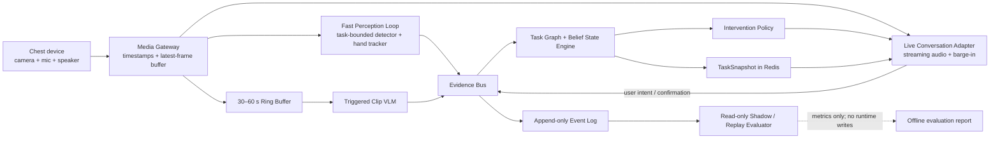

# NomaCook Tomato-to-Fridge Vertical Slice Design

> Status: Proposed for user review
>
> Date: 2026-08-09
>
> Scope: 胸前第一人称设备观察用户把桌上的番茄放入冰箱，并由实时语音模型提供低延迟交互

## 0. Decision Summary

本 vertical slice 采用 **event-first hybrid architecture**：

```text
胸前 camera/mic
  -> 任务限定的 CV 感知
  -> 结构化 evidence events
  -> Task Graph + Belief State Engine
  -> Intervention Policy
  -> Live Conversation Model 说话
  -> Redis hot state + append-only event log 记录
```

关键权责只有一条：

> `StateEngine` 是任务状态的唯一写入者。CV、VLM、Live Conversation Model、用户语音和评估器都只能提供证据或建议，不能直接推进任务。

该设计优先证明可靠的任务执行闭环，而不是展示模型能识别多少物体或进行多少自我分析。

### 0.1 Alternatives considered

| Approach | Benefit | Reason not selected |
|---|---|---|
| Pure Omni/VLM watches and decides | 最快形成演示，交互自然 | 长时状态不可靠，难以回放，单次幻觉可能错误完成任务 |
| End-to-end learned action model | 长期上限高 | 当前缺少足够的胸前任务和错误数据，难以解释和快速修复 |
| Event-first hybrid | 可解释、可回放、容易逐步验证，并能积累未来训练数据 | 需要显式 Task Contract 和 StateEngine，但这是本产品需要拥有的核心资产 |

选择第三条。未来可以用收集的数据替换其中的 perception evidence source，但不改变 StateEngine 的权责边界。

## 1. Objective

用户佩戴胸前设备后，NomaCook 能够：

1. 启动任务 “Move the tomato from the table into the fridge”。
2. 在桌面干扰物存在时，只关注手、番茄、冰箱及其必要空间关系。
3. 在线追踪用户是否拿起、移动并把番茄放入冰箱。
4. 在遮挡或证据不足时继续观察，必要时调用短片段 VLM 或询问用户。
5. 在用户偏离时给出一次有用的提醒，而不是持续播报。
6. 允许用户随时打断、追问或要求重复。
7. 保存可重放事件，使每个状态变化都能追溯到证据。

第一版成功不是“AI 对视频进行完整解释”，而是：

> 在支持条件下，系统可靠地完成一次番茄搬运任务追踪，没有错误宣布完成，并能自然回答用户的实时问题。

## 2. Scope and Non-goals

### 2.1 In scope

- 单个番茄从桌面移动到冰箱内部。
- 一个胸前 RGB 摄像头、麦克风和扬声器。
- 单用户、单任务、单 session。
- 本地或后端运行轻量 CV。
- 一个可替换的 Live Conversation Model provider。
- Redis hot state 和 append-only session event log。
- 受控的 VLM 短片段确认。
- 实时执行、shadow 和离线 replay 三种隔离模式。

### 2.2 Explicitly out of scope

- 识别整个厨房里的所有物体。
- 判断番茄的新鲜度、重量或品种。
- 多个外观近似番茄的身份追踪。
- 自动打开或关闭冰箱。
- 机器人执行动作。
- 通过纯 VLM 连续观看整段 session。
- 让 Live Conversation Model 自主修改 Task Graph、阈值或 prompt。
- 运行时自动比较多个模型、自动调参或自我评测。
- 跨用户长期个性化。

### 2.3 Completion definition

任务只有在以下条件同时满足时完成：

1. 当前追踪的番茄已经跨过冰箱内部区域边界。
2. 番茄不再与手处于 holding 状态。
3. 番茄在冰箱内部稳定存在至少一个确认窗口。
4. 没有同一时间窗口内的强矛盾证据。

关闭冰箱门是推荐的 follow-up，但不属于本 assignment 的完成条件。

## 3. User Experience

### 3.1 Happy path

1. 用户说：“Help me put the tomato into the fridge.”
2. 系统回答：“好的，请拿起桌上的番茄，放到冰箱里面。”
3. 用户拿起番茄。
4. 系统静默更新状态，不播报每个动作。
5. 用户打开冰箱并放入番茄。
6. 系统等待稳定证据，然后说：“完成了。记得关上冰箱门。”

### 3.2 Uncertain path

1. 用户把手伸进冰箱，番茄被身体或冰箱门遮挡。
2. StateEngine 保持 `UNCERTAIN`，不宣布完成。
3. 系统先等待额外多帧证据。
4. 如果超时，VLM 检查事件前后 2–4 秒片段。
5. 仍不确定时，系统问：“我没看清番茄是否已经放进去，可以确认一下吗？”
6. 用户确认只能作为补充证据；如果系统从未观察到拿起、移动或冰箱交互，单句确认不能直接完成任务。

### 3.3 Deviation path

- 用户拿起其他红色物体：保持当前步骤并提示一次“请拿桌上的番茄”。
- 用户拿起番茄后放回桌面：回到 `TOMATO_ON_TABLE`，不视为错误完成。
- 用户离开摄像头画面：进入 `WAITING_FOR_VISIBILITY`，不累计完成证据。
- 用户主动取消：关闭 session，保留 incomplete event log。

## 4. Architecture



### 4.1 Multi-rate execution

不同模块按不同频率工作：

| Loop | Frequency | Purpose |
|---|---:|---|
| Media ingest | camera available rate | 保留最新画面并维持音频流 |
| Fast CV | 5–15 FPS target | 物体、手部和空间关系证据 |
| State update | every accepted event | 确定性地更新 belief 和状态 |
| VLM confirmation | event-triggered only | 处理遮挡、歧义和短动作片段 |
| Live speech | continuous audio | 用户打断和问题回答 |
| Memory summarization | after transition/session | 不阻塞实时链路 |
| Evaluation | shadow or replay | 只读计算指标 |

## 5. Task Recognition Contract

### 5.1 Active entities

```yaml
task_id: tomato_to_fridge_v1
target_object: tomato
actor_anchor: hand
source_region: table_surface
destination_container: refrigerator_interior
optional_context:
  - refrigerator_door
  - refrigerator_handle
ignored_objects:
  - unrelated_food
  - plates
  - utensils
  - countertop_appliances
```

`ignored_objects` 不进入 detector prompt 和状态判断，除非它们成为明确的 confuser，例如红色球或红色包装。

### 5.2 State graph

```text
READY
  -> TOMATO_ON_TABLE
  -> HAND_NEAR_TOMATO
  -> TOMATO_HELD
  -> TOMATO_IN_TRANSIT
  -> FRIDGE_INTERACTION
  -> CANDIDATE_INSIDE_FRIDGE
  -> TOMATO_RELEASED_INSIDE
  -> CONFIRMED_COMPLETE
```

Recovery transitions：

```text
TOMATO_HELD -> TOMATO_ON_TABLE
TOMATO_IN_TRANSIT -> TOMATO_ON_TABLE
CANDIDATE_INSIDE_FRIDGE -> TOMATO_HELD
ANY_ACTIVE_STATE -> WAITING_FOR_VISIBILITY
WAITING_FOR_VISIBILITY -> previous_stable_state
ANY_ACTIVE_STATE -> CANCELLED
```

### 5.3 Evidence needed per important transition

| Transition | Positive evidence | Contradiction / reset |
|---|---|---|
| `TOMATO_ON_TABLE -> HAND_NEAR_TOMATO` | hand/tomato distance below threshold across consecutive frames | hand moves away |
| `HAND_NEAR_TOMATO -> TOMATO_HELD` | grip closure + shared motion + stable hand/object proximity | tomato remains stationary on table |
| `TOMATO_HELD -> TOMATO_IN_TRANSIT` | tomato track moves with hand away from table region | tomato released on table |
| `IN_TRANSIT -> FRIDGE_INTERACTION` | refrigerator/door/interior visible or hand enters fridge approach region | user moves away from fridge |
| `FRIDGE_INTERACTION -> CANDIDATE_INSIDE` | tomato crosses destination ROI or short-clip VLM indicates placement | tomato remains outside |
| `CANDIDATE_INSIDE -> RELEASED_INSIDE` | holding ends while tomato remains in interior | tomato moves back with hand |
| `RELEASED_INSIDE -> COMPLETE` | stable interior presence over confirmation window | renewed holding or tomato exits interior |

### 5.4 Belief rules

- 单帧检测不能推进关键状态。
- 关键 transition 至少需要两个独立证据来源，或一个高置信来源加用户绑定确认。
- Evidence 带 TTL；旧 evidence 自动衰减，不能永久累计。
- Contradiction 可以降低 belief 或回退到上一个稳定状态。
- VLM 输出带 `session_id`、`step_id`、`context_version`、`decision_id`；过期结果被拒绝。
- 用户语音确认必须绑定当前 pending question，不能作为无条件 override。

## 6. Component Contracts

### 6.1 Media Gateway

Responsibilities：

- 设备鉴权、session 建立和时间戳统一。
- 接收 JPEG/H.264 video 与 PCM audio。
- latest-frame buffer 丢旧留新，避免推理积压。
- 保存最近 30–60 秒 ring buffer。
- 将音频送入 Live Conversation Adapter。

The gateway must not：

- 运行模型判断。
- 修改 task state。
- 因模型变慢而阻塞设备 socket。

### 6.2 Fast Perception Worker

第一版候选技术：

- YOLO-World：仅检测当前 Task Contract 的对象词汇。
- MediaPipe Hands：手部关键点、hand box 和 grip geometry。
- Lightweight tracker：保持番茄和手在连续帧中的 identity。
- Region geometry：table、fridge approach 和 refrigerator interior ROI。

输出必须为 schema-valid evidence event，不允许自由文本进入 StateEngine。

### 6.3 Triggered Clip VLM

VLM 只在以下情况运行：

- 状态停留在 `UNCERTAIN` 超过阈值。
- 关键 transition 发生遮挡。
- CV 与用户确认发生冲突。
- 用户明确问“我放进去了吗？”

输入为事件前后短片段、Task Contract 和一个封闭问题，例如：

```text
Did the tracked tomato leave the user's hand and remain inside the refrigerator?
Return: yes | no | uncertain, with observed evidence only.
```

VLM 不能直接说话，也不能推进步骤。

### 6.4 Task Graph + Belief State Engine

Responsibilities：

- 校验 event ordering、TTL、session 和 context version。
- 更新当前 state、belief、missing evidence 和 contradictions。
- 生成不可变 TaskSnapshot。
- 发出 `STATE_CHANGED`、`UNCERTAIN_TIMEOUT`、`DEVIATION` 和 `TASK_COMPLETE`。

只有它能写入：

```json
{
  "task_id": "tomato_to_fridge_v1",
  "state": "TOMATO_IN_TRANSIT",
  "belief": 0.84,
  "status": "ON_TRACK",
  "missing_evidence": ["tomato_inside_fridge", "hand_released"],
  "last_event_seq": 142,
  "context_version": 5
}
```

### 6.5 Intervention Policy

StateEngine 判断发生了什么，Intervention Policy 决定是否说话。

允许触发语音的事件只有：

- `TASK_STARTED`
- `USER_ASKED`
- `UNCERTAIN_TIMEOUT`
- `DEVIATION_CONFIRMED`
- `CRITICAL_RISK`
- `TASK_COMPLETE`
- `RECOVERY_AVAILABLE`

Policy 包含 cooldown、severity 和 recoverability。普通 on-track 状态保持安静。

### 6.6 Memory

Vertical slice 使用两层记忆：

1. Redis `TaskSnapshot`：当前 state、belief、pending question、last event sequence。
2. Append-only event log：完整 evidence、决策、语音 intent 和 model response metadata。

重连时只恢复：

```text
latest TaskSnapshot
+ last 5–10 relevant events
+ current pending question
```

Live model 不依赖自己的 conversation history 恢复任务状态。

## 7. Live Conversation Model Contract

本文件用 `Live Conversation Model` 表示 Qwen Omni Realtime、Gemini Live 或其他可替换 provider。第一版 provider 选择不改变系统权责。

### 7.1 Inputs

- Streaming user audio。
- Compact TaskSnapshot。
- 最近相关的结构化事件。
- 当前 Intervention Policy 指令。
- 必要时低频图像，但不把它作为状态真相。

### 7.2 Allowed outputs

- 回答用户问题。
- 朗读当前 instruction。
- 询问一个绑定当前状态的 clarification question。
- 将用户意图转成 `USER_INTENT` event。
- 将用户对 pending question 的回答转成 `USER_CONFIRMATION` event。

### 7.3 Forbidden outputs

- `advance_step`
- `mark_complete`
- `change_threshold`
- `rewrite_task_graph`
- `switch_model_for_experiment`
- `run_self_evaluation`
- `repeat_warning_without_policy_trigger`

### 7.4 Interaction rules

- 用户语音可以随时打断模型，播放链路应停止当前回复。
- 每次模型回复前读取最新 TaskSnapshot。
- 回复尽量短，默认一到两句。
- 不播报每个 CV observation。
- 当状态不确定时，模型明确表达不确定，不伪装成确定。
- 模型 provider 断线时，StateEngine 继续运行；必要提示由本地固定语音兜底。

### 7.5 Minimum system contract

第一版 Live model system instruction 应保持简短、固定、可测试：

```text
You are NomaCook's real-time conversational guide for one active physical task.
The latest TaskSnapshot is the only source of truth about task progress.
Never claim that a step or task is complete unless TaskSnapshot says so.
Never change task state, thresholds, policies, or the task graph.
Speak only when the user asks or the Intervention Policy requests a response.
Keep responses to one or two short sentences unless the user asks for detail.
If evidence is uncertain, say what is missing and ask at most one question.
Convert user answers into evidence events; do not treat them as direct commands to complete the task.
Stop speaking immediately when the user interrupts.
```

Allowed tools：

```text
get_task_snapshot()
emit_user_intent(intent, transcript)
answer_pending_question(question_id, answer, transcript)
request_instruction_repeat()
```

不存在 `advance_step()` 或 `mark_complete()` 工具。

## 8. Execute-first Runtime

### 8.1 Three isolated modes

| Mode | Can read live media | Can write live state | Can speak to user | Purpose |
|---|---:|---:|---:|---|
| `RUN` | yes | StateEngine only | Intervention Policy only | 正常任务执行 |
| `SHADOW` | mirrored feed/events | no | no | 比较新模型但不影响用户 |
| `REPLAY_EVAL` | recorded session | no | no | 离线回放、打分和调参 |

### 8.2 Runtime invariants

1. `RUN` path 不等待 shadow/evaluator。
2. Evaluator 使用只读 event subscription 和独立 output store。
3. Evaluator 没有 runtime command topic 的凭证或 API。
4. 模型、prompt 和阈值在 session 开始时固定；session 中不自动修改。
5. Self-test 只在 deploy/startup health gate 或离线 replay 中运行。
6. 运行中 health monitor 只检查 liveness、latency、queue depth 和 provider availability，不重新评估模型能力。
7. 任何 experimental output 都标记为 `shadow=true`，StateEngine 拒绝消费。

### 8.3 Circuit breakers

- CV latency 超限：降低采样率，保持 latest-frame semantics。
- VLM 超时：返回 `uncertain`，不重试阻塞主链路。
- Live provider 超时：取消当前生成，使用固定短提示或保持静默。
- Redis 临时不可用：使用进程内 snapshot，事件写入本地 WAL，恢复后补传。
- 时间戳或 sequence 异常：拒绝 event 并记录，不猜测顺序。

## 9. End-to-end Data Flow

1. Session 创建，Task Contract 固定，context version 设为 1。
2. Gateway 开始接收音视频并维护 ring buffer。
3. Fast Perception 只加载 `hand + tomato + refrigerator` 相关词汇和 ROI。
4. Perception 产生 `OBJECT_PRESENT`、`HAND_NEAR`、`HOLDING_START` 等事件。
5. Event log 先追加事件，然后 StateEngine 消费。
6. StateEngine 校验事件并生成新 TaskSnapshot。
7. Intervention Policy 判断是否需要说话；on-track 通常不说。
8. Live Conversation Model 始终读取最新 snapshot 后响应用户。
9. 遮挡导致 belief 卡住时，系统从 ring buffer 取 2–4 秒片段给 VLM。
10. VLM assessment 作为新 evidence event 回到同一 StateEngine。
11. 满足完成条件后，StateEngine 发出唯一的 `TASK_COMPLETE`。
12. 系统生成 session summary；评估器异步读取日志计算指标。

## 10. Validation Program

### Stage 0: Freeze contract and labels

Deliverables：

- Task Contract 和 state graph fixture。
- Event schemas。
- 标注说明：对象框、手部、holding、ROI crossing、release、completion、deviation。
- 场景矩阵：不同光线、视角、桌面干扰物、遮挡和用户速度。

Gate：同一段标注视频由两个实现者独立判断时，对完成状态和主要 transition 没有歧义。

### Stage 1: Record and label offline sessions

开发集至少 30 次：

- 10 次标准 happy path。
- 10 次遮挡、快速动作、改变路径或干扰物。
- 10 次 deliberate deviations，例如拿错物体、放回桌面、伸入冰箱后又拿出。

固定一组独立 acceptance recordings，不用于调 threshold。

Gate：每次 session 都可用统一 schema 重放，且关键状态有 ground truth 时间区间。

### Stage 2: Validate perception events offline

先不接 Live model，只验证：

- tomato/hand/fridge presence。
- hand-near 与 holding transition。
- tomato track continuity。
- refrigerator ROI crossing 和 release evidence。

Gate：错误 event 不会单独构成完成；关键漏检可以通过多帧、短片段或用户确认恢复。

### Stage 3: Validate StateEngine by deterministic replay

把带 ground truth 的 events 和故障 events 反复喂给 StateEngine：

- duplicate event。
- out-of-order event。
- stale VLM response。
- contradiction after candidate completion。
- disconnect and resume。

Gate：相同事件流始终得到相同 TaskSnapshot 序列；评估器和 Live model无法修改状态。

### Stage 4: Silent live shadow test

用户真实执行任务，系统在线观察和记录，但不说话。测试人员看到实时状态面板。

Gate：系统不积压视频；StateEngine 输出实时变化；shadow model 的输出不会影响 live state。

### Stage 5: Add read-only Live Conversation Model

先接 audio、barge-in 和 `get_task_snapshot`，Live model 不接原始状态写接口。

测试问题：

- “What should I do?”
- “Did I pick up the right thing?”
- “Did I already put it inside?”
- 用户在系统说话时打断。

Gate：所有回答基于最新 snapshot；用户打断生效；Live provider 掉线不破坏任务状态。

### Stage 6: Integrated execute-mode acceptance

建议锁定 24 个端到端 acceptance runs：

- 8 个标准执行。
- 8 个自然变化、遮挡和干扰物。
- 8 个 deliberate deviation/recovery。

Proposed MVP gates：

| Metric | Gate |
|---|---:|
| False task completion | 0 / 24 runs |
| Correct completion on valid runs | at least 15 / 16 |
| Deviation detected or clarified | at least 7 / 8 |
| Unnecessary spoken interventions | no more than 1 per successful run |
| State update after decisive evidence | p95 below 500 ms, excluding VLM fallback |
| First speech audio after user turn | p95 below 1.2 s on target network |
| Barge-in playback stop | p95 below 300 ms |
| Reconnect state restoration | below 2 s after transport reconnect |
| Experimental evaluator writes to live state | exactly 0 |

这些是第一版工程验收门槛，不代表统计意义上的产品可靠性证明。扩大用户范围前需要更大、完全独立的 holdout set。

### Stage 7: Soak and failure testing

- 连续运行 20–30 分钟。
- 中途断网、恢复、Live provider timeout、VLM timeout。
- 用户暂停后继续。
- 同一动作以快、慢、左手和右手执行。

Gate：没有状态串 session、没有无限重试、没有语音循环、没有评估任务拖慢 RUN path。

## 11. Test Pyramid

### Unit tests

- Task Contract validation。
- Event schema 和 ordering。
- Evidence TTL、decay 和 contradiction。
- State transitions 和 recovery。
- Intervention cooldown。
- Live model permission boundaries。

### Replay tests

- Golden event logs -> exact snapshot sequence。
- Recorded clips -> expected evidence windows。
- Stale VLM and duplicate event fixtures。

### Integration tests

- Gateway -> Perception -> Event Bus -> StateEngine。
- StateEngine -> Intervention Policy -> Live adapter。
- Redis loss and recovery。
- Device reconnect with same session ID。

### End-to-end tests

- Chest-camera execution with real table and refrigerator。
- Distractor and occlusion scenarios。
- User interruption and correction。
- Full session replay and metric generation。

## 12. Implementation Work Packages

按以下顺序推进，每一包必须通过 gate 后才进入下一包：

1. **Contracts and fixtures**：Task Contract、events、TaskSnapshot、golden logs。
2. **Recording and annotation harness**：采集胸前视频、同步时间戳、标注和 replay。
3. **Task-bounded perception**：hand/tomato/fridge、tracking、ROI 和 evidence events。
4. **Task Graph and StateEngine**：belief、TTL、contradiction、recovery 和 deterministic replay。
5. **Runtime and memory**：Gateway、latest-frame buffer、Redis snapshot、append-only log。
6. **Live Conversation Adapter**：streaming audio、barge-in、read-only snapshot tools。
7. **Intervention Policy and VLM fallback**：只在明确 trigger 下介入。
8. **Shadow evaluator**：独立只读消费、指标和 failure reports。
9. **Integrated acceptance**：24-run gate 和 20–30 分钟 soak。

不先做 UI polish、复杂菜谱、多任务知识图谱或跨 session personalization。

## 13. Observability and Artifacts

每次 session 必须产出：

- `session_meta.json`
- `events.jsonl`
- `snapshots.jsonl`
- `interventions.jsonl`
- VLM request/response metadata，不保存敏感模型密钥
- 关键帧或经用户允许保存的短片段
- `evaluation_report.json`

核心 runtime metrics：

- ingest FPS、dropped frame count。
- perception latency。
- event-to-state latency。
- VLM call rate 和 timeout rate。
- speech first-audio 和 barge-in latency。
- state transitions、rollbacks 和 contradictions。
- unnecessary intervention count。

## 14. Privacy and Safety

- 摄像头和麦克风只在明确 active session 内运行。
- 设备提供可见的 recording indicator 和物理 stop control。
- 默认只保留事件和必要诊断片段，不无限保存连续家庭视频。
- 所有远程模型调用记录 provider、时间和发送的数据类型。
- 任何任务状态失败都降级为“不确定”或用户确认，不编造观察结果。
- 本 vertical slice 不提供食品安全、新鲜度或医学建议。

## 15. Why This Vertical Slice Matters

该任务看似简单，却覆盖了 NomaCook 最重要的可迁移能力：

- 第一人称物体和手部关系。
- 长于单帧的状态保持。
- 遮挡与不确定性处理。
- 结果确认而不是动作分类表演。
- 实时模型与确定性系统的权限分离。
- 低干扰的 human-agent interaction。
- 可重放的数据闭环。

如果这一 vertical slice 不能做到低误判、低打扰，就不应直接扩展到完整做菜。通过后，同一接口可以替换 Task Contract，逐步加入“把鸡蛋放入碗中”“取刀并开始切菜”等更复杂任务。

## 16. Resolved Design Decisions

- 采用 event-first hybrid，不采用纯 Omni/VLM。
- 只由 StateEngine 推进状态。
- Live Conversation Model provider-neutral，且为 read-only conversational layer。
- VLM 使用事件触发短片段，不持续看完整视频。
- `RUN`、`SHADOW`、`REPLAY_EVAL` 强隔离。
- Runtime 不做自动 self-testing 或在线调参。
- 番茄稳定放入冰箱即完成；关门是 follow-up，不是完成条件。
- 第一版优先可靠性和可回放，不追求多任务覆盖。
